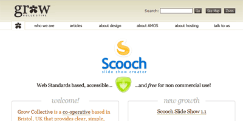

Je viens de lire <a href="http://www.webdesignfromscratch.com/current-style.cfm" hreflang="en">un article intéressant de Ben Hunt sur les tendances actuelles en matière de design web</a>. D'après l'auteur, et je partage son avis, on n'a jamais fait aussi bien qu'en 2006. Les concepteurs de sites maîtrisent de plus en plus leur sujet.

<!-- excerpt -->

Quelques grands points résument la tendance actuelle :

**Une mise en page simple**
On voit de plus en plus de sites à une ou deux colonnes, ce qui sous-entend que les designs simples fonctionnent mieux. L'utilisateur lit la page d'une traite de haut en bas, sans devoir chercher les informations.

**Une mise en page centrée**
Les mises en page alignées à gauche ou fluides (utilisant toute la largeur de l'écran) se font de plus en plus rares. Une mise en page centrée donne une impression de confiance et de simplicité. Pourtant, la sagesse nous a toujours dit qu'il était préférable que l'ensemble du contenu doive tenir sur un seul écran. Ce qui est plus facile avec une mise en page fluide. Mais aujourd'hui, les utilisateurs seraient plus enclins à devoir scroller pour lire le contenu d'une page.

**Des effets effets 3D utilisés avec parcimonie**
Et oui les effets 3D sont à la mode. Mais il ne s'agit en aucun cas des lourds boutons 3D qu'on a connu il y a quelques années. Aujourd'hui c'est beaucoup plus subtil, un léger reflet par-ci ou un fondu par-là. Les ombres sont encore utilisées, mais un peu moins.

**Des couleurs de fond douces et neutre**
On dirait que la mode du fond dégradé disparaît. Aujourd'hui, les sites utilisent une couleur de fond unique, principalement le blanc ou une nuance de gris léger.

**Des couleurs fortes placées judicieusement**
Un fond léger est l'idéal pour faire ressortir les éléments importants avec de la couleur. Des couleurs fortes et contrastées permettent de guider l'utilisateur vers les éléments les plus importants de la page.

**Quelques icônes sympathiques**
Il faut toujours éviter d'utiliser trop d'éléments attractifs sur une page. Cette règle reste d'actualité. Quelques icônes attrayants permettent de donner une impression de qualité à la page. Mais trop utilisés, cela aura l'effet inverse, encombrant la page et semant la confusion auprès de l'utilisateur.

**Beaucoup d'espaces blancs**
Votre oeil a besoin d'espaces blancs pour identifier clairement les éléments d'une page. Evidemment ces espaces ne doivent pas nécessairement être blancs, ils peuvent être d'une autre couleur.

**Des textes très grands**
Le but n'est pas de donner une taille énorme à tout le texte de la page. Il s'agit plutôt de donner une grande taille aux textes les plus importants. Comme les autres techniques citées plus haut, il faut bien sûr l'utiliser avec parcimonie. Un grand texte permet à l'utilisateur de voir immédiatement ce dont parle la page.
