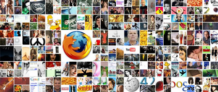

Allez allez, on s'éloigne de [cette succulente polémique](http://64k.be/index.php/2006/08/28/507-perso-web-2006-le-grand-n-importe-quoi) (suffit de dire qu'on aime ça pour que les protagonistes se calment, ça ne changera jamais) pour retrouver nos amours universels, je nommerai Firefox, le sexe, Google, Lost, Wikipédia, Gmail et la musique (pour ne citer que les plus importants). Notez l'immense supériorité de Firefox (aaaah ces geeks!)

[The best stuff in the world](http://www.thebeststuffintheworld.com/) est un site ouvert, organique, polymorphe qui dépend des utilisateurs, qui peut prendre différentes formes et significations. Hum traduction littérale hein. Bon je continue. C'est tout simple, il suffit d'écrire dans le rectangle tout en haut quelle est votre "chose" favorite.. ça peut être n'importe quoi, la chanson qui vous plait le plus, le prénom de votre belle-mère ou même votre petit resto préféré (s'il ne connait pas le "Chez Jules" du quartier où vous avez roulé votre premier patin, vous pouvez l'ajouter à la base de données, pas de panique!)... n'importe quoi, je vous dis.

<!-- excerpt -->

Nous on a mis Nintendo. On a pensé au sexe juste après. N'est pas gamer qui veut. J'avais bien pensé au Bicky aussi, au Nutella, aux Chupa Chups et au pesto mais ma conscience me dit que pendant les 2 mois qui viennent, je ne penserai que pain gris, effi et spécial K.... Enfin je m'éloigne, bref plus on aime une chose, plus elle prend de la place. Logique. Géniale, l'idée. Pour casser l'ambiance, il faudrait faire pareil avec "the worst stuff in the world" mouhahahaha

Il est possible aussi de surveiller ses petits préférés en cliquant dessus, on s'inscrit avec email et mot de passe et hop emballez, c'est pesé. On a son profil et tout, la grand classe web 2.0 que je vous dis. Manque juste un truc, ou alors je n'ai pas les yeux en face des trous, je vois qu'on est 11 à avoir choisi Nintendo, mais 11 sur combien? C'est bien beau les chiffres mais ce serait sympa de savoir combien de personnes ont participé, d'où elles viennent, tout ça...

Enfin bref, belle idée, bon design, rien que du bonheur comme dirait Ernest.

Trouvé sur [cssremix](http://www.cssremix.com/)
