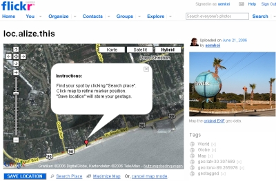

Flickr a lancé il y a quelques jours <a href="http://blog.flickr.com/flickrblog/2006/08/great_shot_wher.html" hreflang="en">un service pour géolocaliser vos photos sur une carte du monde</a>. C'est vraiment bien conçu, cela permet de découvrir des photos d'une nouvelle manière, en plus de la recherche classique, des tags ou des groupes.

Mais il y a un point négatif au tableau : la faible résolution des cartes. En effet, Flickr ayant été racheté par Yahoo!, il utilise donc les cartes de Yahoo! Maps, qui ne sont pas encore très détaillées pour l'Europe. A moins que vous connaissiez exactement les coordonnées géographiques, il est difficile de positionner exactement vos photos sur la carte, surtout s'il s'agit d'un petit village perdu au fin fond de la Belgique.

<!-- excerpt -->

En recherchant un site pour connaître la position d'un endroit à partir de son adresse, j'ai découvert <a href="http://typolis.net/sumaato/stories/4323/" hreflang="en">Flickr Map GeoCoding Bookmarklet</a>, un "vieux" bookmarlet pour Flickr permettant de trouver très précisément la position géographique d'un endroit sur Google Maps. On tape l'adresse et ça renvoie la position au n° de rue près avec les coordonnées latitude/longitude. Nickel, en attendant que les cartes de Yahoo! Maps deviennent plus précises.
