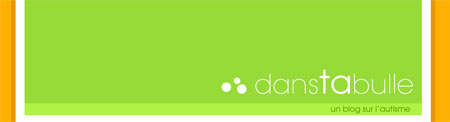
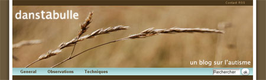

Nouvelle année qui commence, nouvel horaire, nouvelle saison (presque), et donc, nouvelles couleurs... J'en avais un peu marre des couleurs flashantes de mon blog, donc le revoila dans un style plus sobre et qui s'éloigne encore davantage du design original [Falling Leaves de Gilles Marlet](http://www.sporadicnonsense.com/fallingleaves/). D'ailleurs cette fois, j'ai refait le html et le css de A à Z (avec l'aide de Ced, cela va sans dire...)

**(avant)**

<!-- excerpt -->

**(après)**

<ul>
	<li>Absentes du thème d'origine, les catégories se retrouvent maintenant dans la barre de navigation. Impossible si on prévoit beaucoup de catégories mais ici ce n'est pas le cas donc j'en profite. Notez le petit dégradé lumineux dans la barre de navigation mouhahahaha</li>
	<li>Supression de la zone de syndication dans la sidebar, mais ajout du flux RSS tout en haut à droite, en petit.</li>
	<li>Egalement en haut à droite, la possibilité de me contacter.</li>
	<li>Le header avec une photo que j'ai faite (hihi) et une typo plus classique.</li>
	<li>La zone de recherche se trouve maintenant dans la barre de navigation.</li>
	<li>Les liens et les archives restent dans la sidebar. Pourtant j'avais envie d'un menu déroulant ici ou là mais ça aurait peut-être été de trop.</li>
	<li>J'ai aussi gardé le logo et la puce que j'avais faits pour le design précédent, c'est tout simple, j'aime bien.</li>
	<li>Pour les commentaires, j'ai chipoté aux couleurs des encadrés.</li>
	<li>Quelques petits soucis avec ie pour ne pas changer, cette fois c'est au niveau de la zone de recherche et du footer. C'est pourquoi, plutôt que de me prendre la tête pour ça, je vous invite tous, si ce n'est déjà fait, à [télécharger gratuitement Firefox](http://www.firefox.fr/). Du coup, j'ai ajouté un bouton Firefox dans la sidebar.</li>
</ul>
**Linkin Party (wééééé)**
<ul>
	<li>Pour ceux qui voudraient changer leurs couleurs, lisez les articles d'herdo: [typos claires sur fonds foncés, ça marche](http://herdo.be/blog/index.php?2006/07/19/54-les-typos-claires-sur-fonds-fonces-ca-marche) et [le retour du fils](http://herdo.be/blog/index.php?2006/08/23/61-typos-claires-sur-fond-fonce-2-le-retour-du-fils). A bas le bombardement de photons!</li>
	<li>Pour ceux qui n'ont pas d'idée, [lightondark](http://www.lightondark.com/sites/) en propose plein...</li>
	<li>Pour changer ses couleurs quotidiennement, [daily colorscheme](http://beta.dailycolorscheme.com/), via [2803](http://www.2803.com/2006/09/05/daily-colorscheme/)</li>
	<li>Pour assortir les couleurs, [Color Jack](http://www.colorjack.com/studio/) chez [herdo](http://herdo.be/blog/index.php?2006/09/05/63-pour-assortir-vos-couleurs) encore; et [Color Schemer](http://www.colorschemer.com/online.html), dans [del.icio.us](http://del.icio.us/search/?fr=del_icio_us&amp;p=color&amp;type=all)</li>
</ul>
Voila plus d'excuses, tous à vos css.

Sinon, pour le contenu du [blog](http://danstabulle.64k.be/)... J'ai passé pas mal de temps sans faire de billet, exactement 2 mois. Mais dès le 9 septembre, les horaires bien organisés reprennent de plus belle avec le démarrage d'une nouvelle activité de groupe: le **PECS**. Il s'agit d'une méthode de communication par échange d'images. Le but est de faire comprendre aux participants qu'il est possible d'obtenir des choses qu'ils aiment ou qu'ils souhaitent en choisissant une photo et en la donnant à l'éducateur. Ce sera bien utile pour ceux qui ne parlent pas mais souhaitent se rendre aux toilettes, avoir à boire, à manger, etc. Evidemment, ils ne m'ont pas attendu pour se faire comprendre mais la PECS permettra de cadrer le langage et de débloquer de vraies situations de communication (aller vers l'autre, exprimer quelque chose et obtenir un résultat).

Le blog retracera également la suite de **l'évolution de P**. Rappelez-vous de P, en régression depuis le déménagement de l'insitution, il devenait de plus en plus passif et avait besoin de stimulations de plus en plus importantes. Il était même arrivé qu'il s'endorme pendant les activités. La médication a un peu changé (moins grosse dose) et j'ai par contre augmenté sa dose de prise en charge logopédique (3 demis-heures par semaine). Davantage d'exercices verbaux pour réorganiser le cerveau, davantage de participation dans les tâches de la vie quotidiennes (hygiène, passage aux toilettes, passage à table, etc.) Nous avons décidé qu'à la rentrée (dès samedi prochain), P se lèverait avec le groupe de bas niveau (8h30 au lieu de 7h) et serait pris en charge avec eux pour la douche. Il aurait donc presque 2h pour se laver, s'essuyer, s'habiller, se laver les dents et se raser. En l'assistant verbalement, P sera capable de se laver seul de haut en bas; on espère qu'il retrouvera de cette façon quelques habitudes d'hygiène qu'il avait perdues car petit à petit, nous faisions les choses à sa place et ça avait sans doute contribué à sa régression. Nous avons testé ce type de stimulation pendant les mois de vacances et P sait maintenant se laver les dents +- seul, depuis l'application du dentrifrice jusqu'au rinçage du gobelet.

Le blog fera part également de mes **réflexions** sur le sujet de l'autisme et plus généralement du handicap mental, des **techniques de rééducation** que j'utilise ou à propos desquelles je me pose des questions et des nouveautés en matière de **recherche scientifique**.
