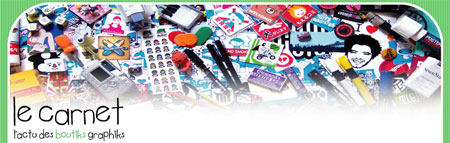

Excellent blog que j'ai découvert il y a quelques jours, je ne sais plus trop comment. [Le carnet](http://www.lecarnet.info/) parle de plein de trucs tendances, des ouèbe-shopping, des customiz-do-it-yourself en tout genre, depuis le t-shirt, principe auquel nous sommes désormais habitués, jusqu'aux espadrilles (si si!) J'y ai aussi retrouvé quelques liens qui m'ont bien fait plaisir; [les aventures de Lenore, la jolie petite fille morte](http://www.nightrose.com/lenore.htm), [Kezako](http://www.kezako.be/shop/) (où je viens de commander 10 badges, c'est 1 euro le badge, tous à vos Paypal), et plein plein d'autres parmi son impressionnante liste (une colonne rien que pour les liens, c'est dire!). Les infos sont fréquentes, le blog est beau, la lecture est agréable. Que du bon!

<!-- excerpt -->

Enfin bref, il rejoint nos liens, et Kezako aussi. ^-^
