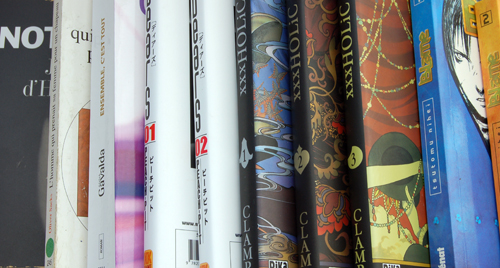
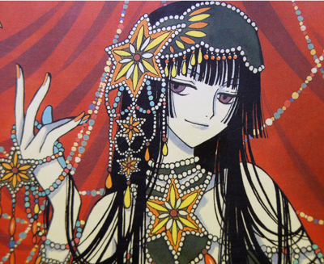

J'ai un boulot de cinglé en ce moment, c'est pour ça que je blogue moins. En gros, depuis samedi passé, j'ai bossé une moyenne de 10h chaque jour. Du coup ça fatigue. Ce soir, je termine à 21h (argh) Sinon la semaine de congé qui a précédé était cool. Petite visite à Liège le jeudi, photos à La Panne et shopping à Anvers le vendredi. Les congés ont aussi été l'occasion de lire. J'ai parfois des périodes comme ça où je suis insatiable de lecture.

<!-- excerpt -->

J'ai donc commencé par ["Ensemble, c'est tout" d'Anna Gavalda](http://www.amazon.fr/exec/obidos/ASIN/2290343714/64kleblodesop-21). Très chouette auteure que j'ai découvert avec ["Je voudrais que quelqu'un m'attende quelque part"](http://www.amazon.fr/exec/obidos/ASIN/2290311782/64kleblodesop-21), recueil de nouvelles et ["Je l'aimais"](http://www.amazon.fr/exec/obidos/ASIN/2290340782/64kleblodesop-21). Elle écrit magnifiquement bien avec beaucoup de spontanéité. Dans "Ensemble, c'est tout", elle décrit 4 personnages en mal de vivre qui se rencontrent et se sauvent mutuellement la vie.

J'ai aussi lu quelques extraits de ["L'homme qui prenait sa femme pour un chapeau"](http://www.amazon.fr/exec/obidos/ASIN/2020146304/64kleblodesop-21), d'Oliver Sacks. C'est un essai d'observations cliniques. Oliver Sacks est neurologue à New York et a eu l'occasion d'observer les bizarreries des cerveaux qui flanchent. Syndrome de Tourette, prison du temps, dédoublement de personnalité, grand mal et délires divers. J'avais lu ce bouquin quand j'étais étudiante, ça ne m'avait pas particlièrement marqué, il s'était plus ou moins perdu dans la masse des choses à faire de l'époque. Maintenant je le lis différemment. Le cerveau est vraiment étrange, on n'en connait qu'une petite partie et certains accidents vasculaires, certaines tumeurs, certains troubles, peuvent mettre en évidence des endroits que nous ne connaissons pas encore bien. Reconnaitre les gens grâce à leur voix, et donc ne plus les reconnaitre s'ils ont un rhume, prendre les gens pour des objets et inversément... Excellent pour ceux qui veulent s'étonner.

Je n'ai bien sûr pas échappé au Nothomb de la rentrée. ["Journal d'hirondelle"](http://www.amazon.fr/exec/obidos/ASIN/2226173358/64kleblodesop-21) raconte la vie d'un coursier qui se fait virer et devient tueur à gages. Il tue, il aime ça et s'en fait jouir dès qu'il rentre chez lui. Le crime est d'ailleurs la seule chose qui puisse encore le faire jouir. Un jour, il a pour mission de tuer un ministre et sa famille et de ramener le porte-documents du ministre. Il fait son travail et trouve le journal intime de la fille du ministre dans le porte-document. Il le lit et ça lui change la vie. On reconnait l'écriture d'Amélie Nothomb dans la maîtrise de l'émotion et de l'excès, on sent qu'elle a aimé écrire ce livre. C'est une tordue, n'empêche. Elle semble avoir eu une facilité dingue à se mettre à la place d'un tueur et à ressentir ses émotions. Elle ferait presque peur.

Alors, grand moment, grande nouveauté, j'ai commencé à lire des mangas. Et oui. Ca faisait un moment que Ced me disait que ça me plairait mais je n'étais pas encore rentrée dans un magasin spécialisé. A liège, on a sauté sur l'occasion. Espace 9ème art, rue Pont d'Avroy à Liège, c'est de là que viennent mes premiers mangas. Il y a une vendeuse asiatique qui semble connaitre absolument toutes les histoires des livres qui tapissent sa boutique. Fascinante! Enfin bref, elle m'a admirablement conseillé. J'ai pris les 1ers de [Dears](http://www.amazon.fr/exec/obidos/ASIN/2351000420/64kleblodesop-21) et de [Holic](http://www.amazon.fr/exec/obidos/ASIN/2845993595/64kleblodesop-21). Je les ai dévoré. A Anvers, le lendemain, j'ai pris le 2eme de Dears et les 2 et 3èmes de Holic.

Dears raconte l'histoire d'une soucoupe volante qui tombe au Japon. Les extra-terrestres sont tout sauf moches, cons et hostiles. Ce sont de jolies jeunes filles avec de grosses poitrines et de terribles capacités intellectuelles et d'adaptation. Elles ont vite fait d'apprendre le japonais et la vie terrienne. Elles sont programmées pour être des esclaves. Une de ces jeunes filles arrive toute naïve chez un gars et s'intègre dans son école, seulement, la demoiselle a une erreur de programmation.... Et je n'ai lu que les 2 premiers donc je ne saurais pas en dire beaucoup plus. Sinon j'aime bien. C'est du même créateur que Chobits, c'est d'ailleurs pour ça que je l'ai choisi.

Holic raconte la vie d'un étudiant qui rencontre une médium. Elle réalise des voeux en échange de la chose la plus précieuse de son client. Dans le cas de Watanuki, il a des visions cauchemardesques. Elle accepte de l'aider à s'en débarrasser en échange de quoi, il devient "son commis". Faire la cuisine, le ménage, et surtout assister à ses autres rencontres. Les esprits du mal, l'angel-san, l'univers est sombre, c'est terriblement stressant et je deviens folle si je n'ai pas la suite dans les heures qui viennent.

Je vais sans doute commencer [Blame](http://www.amazon.fr/exec/obidos/ASIN/2723434915/64kleblodesop-21), Ced a les deux premiers qui trainent dans l'étagère.

Enfin bref j'ai le virus, ça y est, je suis une lectrice de mangas, notre maison en sera tapissée, il y aura une pièce exprès et je dépenserai des fortunes pour des mini figurines qui prendront la poussière (sauf si je pousse le vice jusqu'à acheter une vitrine hum) Si ça continue, je vais devenir une vicking urbaine (private  joke ;-) )

**MàJ**: Mouhahahaha je viens de trouver Holic 4 et 5 à la librairie du coin, 6 et 7 sont commandés pour la semaine prochaine et le 8 va bientot paraitre :-D
