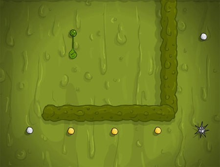

Aussi addictif que [Bliblu Souhissaide](http://64k.be/index.php/2006/06/18/465-bliblu-souhissaide), [Sling](http://sling.ezone.com/game.htm) est une petite chose verte et gluante qu'on a tous lancé sur les fenêtres de la maison au moins une fois dans notre vie, au grand damn de nos mères, tout ça pour voir la chose dégouliner jusque dans le bas de la vitre. Sling, c'est pareil sauf qu'il doit retrouver l'un des éléments nécessaire au bon fonctionnement de la vie dans sa dimension. Un méchant monstre difforme et tentaculaire l'a dérobé et l'a emmené dans une autre dimension. Un petit vieux passera 5 minutes à vous expliquer en anglais comment étendre la masse gluante qu'est votre corps et la lancer contre un mur pour rebondir et s'accrocher ensuite à une prise pour atteindre la prise suivante et ainsi de suite jusqu'à ce que cette dimension s'ouvre sur la dimension suivante. 50 niveaux pour s'arracher les cheveux et retrouver le slime, cet élément si important à la vie des Slings. Le truc chouette ici, c'est qu'on peut foirer un certain nombre de fois avant de devoir tout reprendre depuis le début.

<!-- excerpt -->

trouvé sur [Kopikol](http://www.kopikol.net/), encore.
