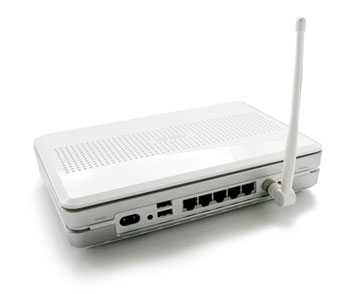

Clubic a testé un routeur WiFi assez original. En effet, l'<a href="http://www.clubic.com/article-38383-1-asus-wl-700ge-routeur-wifi-bittorrent.html" hreflang="fr">Asus WL-700gE</a> prend en charge le protocole BitTorrent et inclus un disque dur. Fini de laissez tourner son PC toute la nuit pour télécharger le dernier épisode de Pris... oups je veux dire une image ISO de votre distribution Linux favorite ^-^

<!-- excerpt -->

Evidemment ce n'est pas donné (<a href="http://www.ldlc.com/fiche/PB00042869.html" hreflang="fr">279€ chez LDLC</a>).
