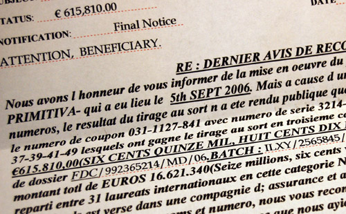
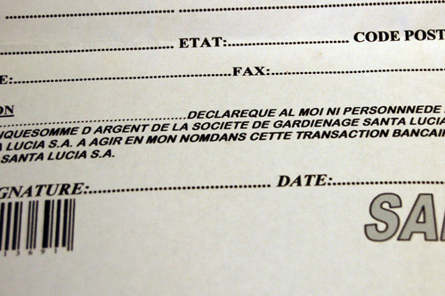

Nous avons le grand plaisir de vous annoncer que nous avons gagné 615 810 euros à la loterie. On est trop doués. Ca fait l'équivalent de trois petites villas, ou deux grosses, ou une très grosse.

<!-- excerpt -->

Encore plus doués lorsqu'on sait que d'une part, nous ne jouons jamais à la loterie; et d'autre part, il s'agit de La Primitiva, une loterie espagnole.

La primitiva a donc eu l'extrême gentillesse de nous faire part de nos gains par un dernier avis (c'est également le premier), et tout cela, même pas par email, directement par courrier papier, dans notre boite aux lettres à nous, à Enghien. En fait, nous avons gagné cette somme depuis le 5 septembre, mais il y a eu confusion en la demeure et le tirage au sort n'a été public que le 2 octobre. Sans le savoir, nous avons donc joué les 21, 22, 37, 39, 41 et 49. Chiffres qui nous ont porté bonheur.

Il est maintenant temps de prendre contact avec le Dr. Louis Rivas, lui donner notre numero de compte, pour qu'il puisse y verser la somme susmentionnée. Il en profitera également, grâce à notre accord, pour en prélever 10%. Pas un centime de plus, c'est promis.

J'arrête là, vous aurez compris qu'il s'agit de la version papier (plus concrète, qui entre dans vos maisons, s'installe dans votre privée et accroît votre crédulité) des spams et [cyber-criminalité](http://www.e-prevention.ch/web/detail_fiches.asp?id_fiche=130) bien connues de nos boites mails...

**Quelques témoignages (pas de moi!! d'autres personnes!), pour ceux qui ont la flemme de cliquer sur le lien:**
<ul>
	<li>_Sur le coin supérieur droit de la lettre, ils ont apposé une photo perso retravaillée que j'ai faite moi-même et que j'utilisais uniquement sur un forum espagnol comme avatar. Est-il possible qu'ils aient toutes nos infos à cause de nos inscriptions sur des forums d'internet?_</li>
</ul>
<ul>
	<li>_J'ai reçu le même courrier m'informant d'un gain de plusieurs centaines de milliers d'euros : quelle ne fut pas ma surprise lorsque ma mère m'informait par téléphone qu'elle avait reçu exactement le même courrier avec le même gain (615.810 euros)...la probabilité étant quasi nul d'être 2 dans la même famille parmi 31 personnes au niveau international à avoir gagné...c'est vraiment une très grosse arnaque : j'ai donc detruit ce courrier ainsi que ma mère et on a remis les pieds sur terre!_</li>
</ul>
<ul>
	<li>_ J'ai également recu de courrier m'annoncant un gain de 615.810 € en provenance de la loteria primitiva  Il demandait un virement de 1850€ pour frais de virement electronique ! _</li>
</ul>
Il reste des gens crédules, des gens qui n'ont pas l'opportunité de se renseigner sur le net, des petits vieux qui jouent le jeu, renvoient papiers, fax et numéros de compte en se disant "ce sera pour nos petits enfants"...
