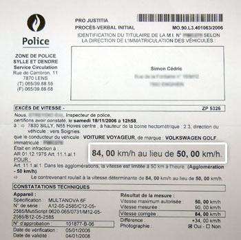

Et oui la Belgique rattrape son retard en matière de contrôle radar. Je viens de recevoir mon premier PV, j'ai fait fort  :^:

<!-- excerpt -->

Ca doit être l'effet des bouchons le matin sur le Ring 0 pour aller au boulot. Le week-end, je me défoule à des vitesses _vertigineuses_ au volant de ma VW Golf III _Turbo Diesel_ 75ch de 94. Arf :p Pour ceux qui passent dans le coin et qui voudraient faire mieux, c'était sur la N55 entre Enghien et Soignies, à hauteur de Hoves, un samedi vers midi.

Je voulais justement tester le train pour aller à mon nouveau boulot, je pense que ça va être le moment idéal :p
