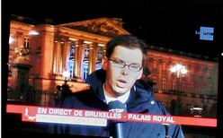

Hier soir, nous étions chez notre courtier pour signer le prêt de notre future maison. Tout d'un coup sa femme lui téléphone et lui explique qu'elle est devant la télévision, qu'il y a un flash spécial sur la RTBF, la Flandre vient de signer la sécession, le Roi est parti. Fini la Belgique !

Après quelques secondes d'hésitation, non c'est pas possible rien de tel ne se décide en une après-midi, on s'est vite dit que ça devait être une fiction. Ce n'est qu'après quelques longues minutes (32 minutes) que la RTBF a effectivement inscrit en bas de l'écran "ceci est une fiction". Les "quelques longues minutes" où la fiction dépassait la réalité étaient voulues et cela entraine maintenant nombre de polémiques. La RTBF a t'elle perdu de sa crédibilité? Peut-on jouer avec le téléspectateur de la sorte? Auraient-ils dû directement inscrire qu'il ne s'agissait que d'une fiction?

<!-- excerpt -->

Personnellement, Ced et moi faisons partie des quelques pourcents qui n'y ont pas cru, ou alors juste quelques secondes, le temps de digérer l'info. Que la Flandre et la Wallonie se séparent, on y arrivera sans doute un jour, je trouve que le fossé est de plus en plus large. Ce qui m'a mis la puce à l'oreille c'est que le Roi quitte la Belgique. C'est pas le genre de la maison. Ou alors, je suis naïve et j'ai trop confiance mais lorsque ça arrivera, je suis persuadée qu'il y aura des pourparler pendant des semaines, des gouvernements qui tomberont, se relèveront, retomberont. Ce n'est pas l'affaire d'une demi journée et je suis même un peu étonnée que 89 % des Belges y aient cru tant que l'inscription "ceci est une fiction" n'était pas mise. Cela dit, en voyant un tel pourcentage de gens qui suivent les médias avec la plus grande confiance et la plus grande crédulité possible, je ne m'étonne plus du succès d'émissions comme la "starac"...

Il y a donc depuis hier soir des polémiques qui soulèvent même les ministres. Des gens se plaignent, accusent la RTBF de tous les maux "vous êtes irresponsables" "vous ne faites qu'attiser les tensions", etc. Ce qu'ils appellent "canulard" était en fait un docu-fiction destiné à responsabiliser le tout public d'un problème qui ne concerne pour l'instant que les politiciens. Si quelques politiciens ont d'ailleurs joué le jeu en acceptant de se mettre également en situation et de répondre à des interviews, d'autres râlent que le tout public ait pu se mettre en situation réelle, qu'il passe par la tête de la population qu'une telle décision ait pu être prise sans qu'elle n'ait eu son mot à dire. Ceux-ci préfèrent sans doute que la population se gâve de téléréalité ou des Experts à Miami avec des pubs pour les tampax sur RTL-TVI, plutôt que de documentaires qui amènent à la réflexion.

[L'article de la RTBF](http://www.rtbf.be/info/societe/ARTICLE_058137)
[L'article de La Libre](http://www.lalibre.be/article.phtml?id=10&amp;subid=90&amp;art_id=320310)

**MàJ:** <a hreflang="fr" href="http://www.petitiononline.com/rtbf1312/">La petition en soutien à la RTBF</a>
