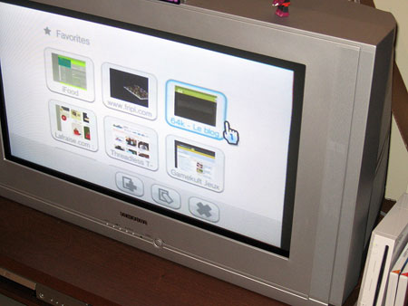
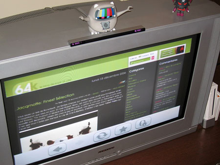

[Fripi](http://www.fripi.com) nous envoie deux petites photos de 64k sur la Wii. Je l'imagine vautré dans son canapé la Wiimote à la main, rien de tel pour lire le blog :p

<!-- excerpt -->

Comme sur Nintendo DS, il s'agit d'<a href="http://www.opera.com/products/devices/nintendo/" hreflang="fr">Opera</a>.

Au programme, une fonction Intelligent Zoom (le rendu d'une télé n'est pas idéal pour la lecture de texte), le scrolling avec la Wiimote, la gestion des favoris, un clavier virtuel, le support de sites AJAX tel que Google Maps, le support du Flash (version 7), etc. <a href="http://www.opera.com/pressreleases/en/2006/12/22/" hreflang="en">Plus d'infos ici</a>
