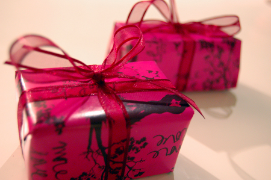
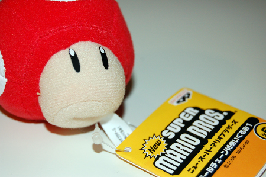
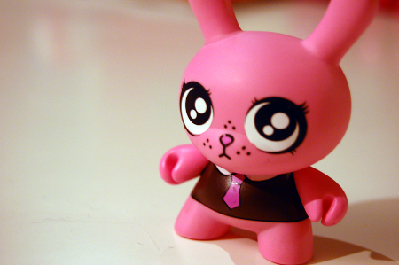
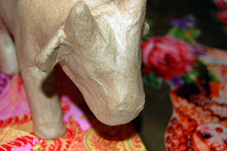
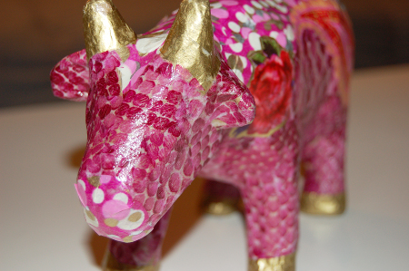

La grosse question de ce matin était "Mais où diantre allons-nous faire notre shopping de Noël, mon coeur?" (à peu de chose près). Invités dans la famille ce dimanche après-midi, nous avions prévu d'acheter nos cadeaux dans le gros rush. Oui mais où? Anvers? Liège? Bruxelles? C'est finalement à Lille que nous avons décidé de nous rendre, comme lors du Noël dernier.

Une partie de Lille semble en ce moment transformée en [Bombay](http://www.lille3000.com/). Des [éléphants](http://ced64k.proximusmoblog.be/moblogs/view/detail.cfm?id=99f9c196-4466-4881-82c3-5b3004e38caa) encadrent les rues, des lumières transforment la gare en palais de Maharadjah...

<!-- excerpt -->

Nous voila donc sur [l'autoroute](http://ced64k.proximusmoblog.be/moblogs/view/detail.cfm?id=2ea61279-481a-4eb9-87da-0f5c8f8bcf2d). Lille est à une grosse demi-heure de chez nous, 45 minutes en comptant le temps de rentrer dans le parking d'Euralille, se garer, tout ça. En parlant du parking d'Euralille, je pense que c'est le pire parking sous-terrain que je connaisse. A l'exception peut-être du parking-labyrinthe sous Ethias de Namur.

Direction le resto puis shopping dans la galerie. Direction surtout "Album", un magasin de [BD](http://ced64k.proximusmoblog.be/moblogs/view/detail.cfm?id=59353849-6716-4977-a797-a0f020196fa5), de [mangas](http://ced64k.proximusmoblog.be/moblogs/view/detail.cfm?id=d7a0f72e-5325-48cc-9c43-7d0bd3352d70) et des figurines qui vont avec. J'ai choisi un cadeau pour Ced et il a fait pareil pour moi. L'heure est à la geekattitude, une figurine pour chacun. Le petit Mushroom pour Ced et la petite lapine pour moi.

Direction ensuite Planète Saturn.... qui a déménagé pour cause d'insécurité (il se trouve maintenant dans un zoning commercial aux portes de la ville) Hum. C'est un peu ce qui motivait Ced à venir à Lille, je ne sais pas encore comment je le déciderai la prochaine fois. Direction donc "Loisirs et Créations" où j'ai encore une fois testé les limites de l'amour que Ced me porte, et où je me suis trouvé une vache en pâte à papier que je compte décorer dans des tons bien kitch (affaire à suivre)

Et puis bien sûr, la Fnac, pour se rattraper du Planète Saturn, où la foule est carrément oppressante.

[Retour ensuite](http://ced64k.proximusmoblog.be/moblogs/view/detail.cfm?id=e9ed0190-4584-40bb-bdee-bf3906e33c24), des sacs plein le coffre avec l'impatience de mettre les cadeaux sous le sapin demain. Aaahh Noël, la fête a beau avoir perdu tout le cachet catholique qu'elle pouvait avoir (non, je n'irai pas à la messe) et être devenue presqu'exclusivement commerciale, toutes ces lumières, ces gens partout, ces couleurs... à chaque fois je me dis qu'on ne m'y reprendra plus et à chaque fois je replonge.

Puis l'année se termine... L'année 2006 se termine. Pour nous, 2006 a été importante. La recherche de terrain en février dernier, les démarches avec les sociétés, l'architecte, les services administratifs et banquaires... puis le changement de boulot de Ced, son activité d'indépendant complémentaire et tous les projets qui vont avec... une belle évolution aussi pour mon boulot au niveau des (énormes) progrès que font mes patients après ces 12 mois de prise en charge.

Nous espérons 2007 aussi haut en couleur. En février-mars (un an après avoir trouvé le terrain!) la construction commencera avec sans doute le lot habituel de prises de tête avec l'entrepreneur. On espère que pour septembre-octobre, la maison sera finie. Barbec géant d'été deviendra barbec géant d'automne...

Sur ce, Joyeux Noël et Bonne Année à tous.

MàJ: Voila la vache!

Avant:

Après:

Décorée avec la méthode du [décopatch](http://www.decopatch.com/). Un peu comme le collage de serviettes mais en mieux. Ici, ça ne déteint pas, ça sèche plus vite et les couleurs sont plus flash.
