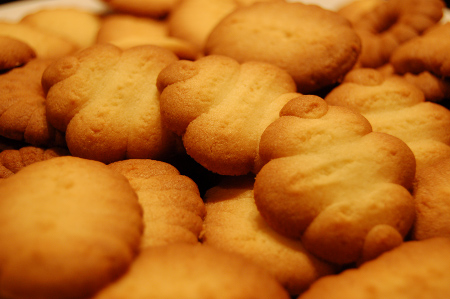

Mais dis donc ça devient un blog de cuisine ici! Je sais je sais, la cuisine, les desserts, ça vous laisse de marbre, vous les geeks. A part mon amoureux qui me dit "Hum ch'est bon" la bouche remplie des petites douceurs que je lui fais, tout le monde s'en fiche. Tant pis, j'ai un nouveau jouet, donc je m'amuse.

En cherchant une poche à douilles pour faire le [Paris-Brest d'hier](http://64k.be/index.php/2006/12/26/580-paris-brest), j'ai trouvé mieux: un tube à douilles qui permet non seulement d'allonger la pâte   mais aussi, grâce à des petites plaques perforées, de faire des biscuits comme dans les jolies boites de nos mamis.

<!-- excerpt -->

On remplit le tube de pâte, on choisit la forme qu'on souhaite et on appuie sur la poignée. Le tube s'enfonce d'un cran, et à chaque cran, la bonne quantité de pâte sort par les petits trous, et s'écrase sur le papier alu en une jolie forme. Magique.

Donc voici la recette de la pâte à biscuits (pâte sablée, je pense). Reportez votre régime de quelques jours parce que ça va chauffer!

Pour une bonne cinquantaine de biscuits (quand on compte sur la dose du tube à douilles), ce n'est pas une pâte à étaler et à découper avec un emporte-pièces, c'est vraiment une pâte qui s'étale avec des douilles.
<ul>
	<li>150 gr de beurre</li>
	<li>75 gr de sucre</li>
	<li>1 jaune d'oeuf</li>
	<li>2 cuillers à soupe de crême fraiche</li>
	<li>100 gr de maïzena</li>
	<li>100 gr de farine</li>
</ul>
Mettre dans une terrine le beurre fondu, le sucre, le jaune d'oeuf, la creme fraiche, le maïzena et 1/3 de la farine; Mélanger vivement au fouet jusqu'à ce que la pâte soit homogène.

Ajouter le reste de la farine et mélanger à la cuiller en bois jusqu'à ce que le mélange soit homogène (c'est trop épais pour un fouet)

Laisser la pâte au frigo pendant une demi heure.

La pâte doit avoir un aspect un peu rigide mais pas trop, et en même temps friable mais un peu collante. Malléable.

Remplir le tube (ou la poche ou n'importe quoi pourvu que ça fasse de jolies petites formes de 5 cm de long sur 1 cm de haut). Ne surtout pas graisser la plaque ou la feuille d'alu, ça se décolle tout seul. Tu m'étonnes, avec tout le beurre qu'il y a dedans, y a intérêt que ça ne colle pas!

Préchauffer le four à 180 ou 200 degrès (selon si le four va fort ou pas)

Quand le four est bien chaud, mettre la plaque pendant 10 à 15 minutes, en surveillant souvent vers la fin. Les biscuits commencent à dorer depuis la base. L'idéal est de laisser un peu plus clair sur le haut du biscuit, ça fait plus pro 8-)

Laisser refroidir avant de refaire une nouvelle fournée; Je fais +- 20 biscuits par fournée, pas davantage sinon ils sont trop serrés sur la plaque et comme ils s'élargissent un peu en cuisant, ils risquent de se coller entre eux. Sauf si vous avez un four XXL, bien sûr.

Si vous êtes doués en nappage (ce qui n'est pas mon cas), vous pouvez vous la jouer [Delacre](http://www.delacre.com/products/images%5Cmarquisette_pic.jpg) et décorer vos biscuits d'un peu de chocolat...

