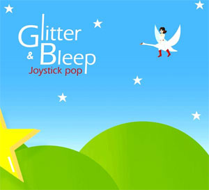

Je viens de faire une sympathique découverte via l'émission <a href="http://www.mcmbe.tv/programmes/evenements-mcm/focus/346/" hreflang="fr">Next Gen</a> sur MCM : <a href="http://www.myspace.com/joystickdigitalpop" hreflang="fr">Glitter &amp; Bleep (Joystick Pop)</a>, un album complet dédié à la <a href="http://fr.wikipedia.org/wiki/Chiptune" hreflang="fr">chiptune</a>. Marrant, c'est pas du tout "Next Gen" comme truc. Si vous ne connaissez pas la chiptune c'est de _la musique faite avec des ordinateurs ou consoles de quand on était petit_ (Commodore 64, Amstrad CPC, Game Boy et autres) ^-^

"Un Chiptune est une musique écrite dans des formats audio pour lesquels les sons sont synthétisés en temps réel par un ordinateur ou une puce audio de console de jeu vidéo. L'"âge d'or" des chiptunes a été la période du milieu des années 1980 au début des années 1990, quand de telles puces audio étaient les seuls moyens largement disponibles pour créer de la musique sur ordinateur." (<a href="http://fr.wikipedia.org/wiki/Chiptune" hreflang="fr">Wikipédia)</a>

<!-- excerpt -->

J'avais découvert la scène chiptune en 2002 lors du Pix Festival à Lilles. Il y avait un set de <a href="http://redofromstart.com/" hreflang="fr">Trez &amp; Brioche</a>, deux DJ belges, spécialisés dans les mix de musique de jeux vidéo des années 80. Imaginez des mix répondant au doux nom d'<a href="http://redofromstart.com/tracks/trez_and_brioche-alex_kidd_in_shinobi_world_level_1_paris_vip_mix.mp3" hreflang="fr">Alex Kidd In Shinobi World Level 1 (Paris VIP Mix)</a> par exemple.

Pour en revenir à l'album Glitter &amp; Bleep, il s'agit à la base d'un projet de Thierry Criscione et Jacques Fantino réunissant des artistes de la scène chiptune internationale. C'est une chiptune moins "hardcore", beaucoup plus écoutable. En voici un extrait, avec le clip "Zolöft Blues" de THE HARDLINER. Evidemment, c'est fait en <a href="http://fr.wikipedia.org/wiki/Pixel_art" hreflang="fr">Pixel art</a> ^-^

<object width="425" height="350"><param name="movie" value="http://www.youtube.com/v/04cYBD1jSng"></param><param name="wmode" value="transparent"></param><embed src="http://www.youtube.com/v/04cYBD1jSng" type="application/x-shockwave-flash" wmode="transparent" width="425" height="350"></embed></object>
</object>

Et si vous voulez encore de la chiptune, rendez-vous sur <a href="http://www.scenemusic.net/" hreflang="en">Nectarine Demoscene Radio</a>.
