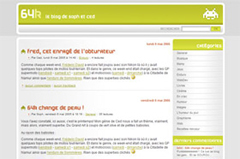
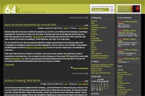

C'est l'âge du blog... Petit tour récapitulatif, allez.

 

<!-- excerpt -->

Le premier billet date du 26 janvier. Aucune présentation, directement l'entrée en matière de Ced qui fait un billet qui n'annonce pas la couleur. [U2 au stade Roi Baudouin](http://64k.be/index.php/2005/01/26/2-u2-au-stade-roi-baudoin). Aucun commentaire (tu m'étonnes!)

Alors quels sont les moments forts... ma première recette de cuisine, [les macarons à la canelle](http://64k.be/index.php/2005/01/28/7-sequence-mamy). Me souviens que j'avais eu un coup de déprime et que soudainement, après plusieurs jours d'envie de rien, j'avais eu envie de cuisiner et j'étais tombée sur la recette des macarons à la canelle. Je les avais réussi (heureusement sinon c'était la balle dans la tête!) et comme ça m'avait fait du bien, je l'avais noté sur le blog. Puis pour la chandeleur, j'avais mis [une recette de crêpes](http://64k.be/index.php/2005/02/02/9-cest-la-chandeleur), qui est gentiment passée inaperçue puisqu'à l'époque, on devait avoir trois lecteurs (dont Ced et moi). C'est toujours cette recette que j'utilise, elle a l'avantage de ne pas avoir de temps de repos. Que c'est frustrant de devoir laisser la pâte reposer quand on a envie de crêpes!

Puis Ced attaque et nous montre une partie (une infiiime fraction) de son côté geek, il annonce enfin la couleur en parlant de [référencement](http://64k.be/index.php/2005/02/24/30-optimiser-son-site-pour-le-referencement).  A l'époque, on parlait déjà de réchauffement de la planète, mais [ce n'était que théorique](http://64k.be/index.php/2005/03/02/43-il-neige-encore). Je [débutais en Illustrator](http://64k.be/index.php/2005/03/09/61-yeah-baby-yeah) sous les conseils avisés de Ced. C'est ensuite qu'il dévoila encore une autre partie de sa geekitude (fraction nettement plus large): la nostalgie dans les jeux videos. Vous ne saviez pas encore (moi non plus) dans quoi vous alliez être embarqués (surtout moi). Ced veut [une borne d'arcade](http://64k.be/index.php/2005/03/30/93-une-borne-darcade-a-la-maison). Dans notre 70m². Comme il comprend que ce sera mieux quand on aura une maison, il décide <del>d'acheter une maison</del> de construire lui-même sa borne d'arcade, mais en plus petit, la boite qu'il appellera avec amour et tendresse son "aBox", la boite avec laquelle [j'ai laminé Herdo à Street Fighter](http://64k.be/index.php/gallery/la-fete/annif-ced-200/abox2#gallery). Il commande donc [les boutons](http://64k.be/index.php/2005/04/05/97-commande-chez-xgaming),  bidouille, [détruit mon clavier](http://64k.be/index.php/2005/04/14/115-arcade-box-les-premieres-photos) (mais c'est pour la science, enfin!!), reçoit [ses premières images](http://64k.be/index.php/2005/04/26/124-abox-limage-sur-la-tv) sur mon-écran-que-j'avais-au-kot (mais puisque c'est pour la science...), et joue à son [premier jeu sur l'aBox](http://64k.be/index.php/2005/04/28/129-abox-laffichage-est-ok). Il parle de tout cela tant et si bien que le virus me touche, [je deviens une geekette](http://64k.be/index.php/2005/04/13/111-parce-que-nous-sommes-des-femmes). [La réussite de l'aBox](http://64k.be/index.php/2005/05/19/152-abox-quelques-screenshots) ne diminue pas l'envie d'une borne d'arcade, une vraie. Et c'est ainsi que sur un coup de fil de [Fripi](http://www.fripi.com/), vers 21h, nous partons vers 21h01, nous perdre entre Enghien et Lillois à la recherche de [bornes abandonnées](http://64k.be/index.php/2005/05/10/143-voila-comment-finissent-les-bornes-d-arcade) le long d'une route pour le passage du camion-poubelle des encombrants. Oserai-je vous dire où se trouve l'aBox en ce moment?

Grand moment dans le référencement Google du blog: [toutesdesputes](http://64k.be/index.php/2005/05/19/150-google-est-parfois-etrange). Qui ne se souvient pas de cet épisode machiste de Google. Tapez toutesdesbeautés et obtenez toutesdesputes. A ce moment là, les gens qui arrivaient sur le blog avec ce mot-clé là représentaient  presque 50% des arrivants; Ce n'était pas prémédité mais ça nous a permis de nous faire connaitre. Les visites ayant augmenté, le pourcentage est redescendu à 1,54% (ou 16000 visites). Un autre billet qui a fait son petit effet sur les visites du blog était le [Transatlantys](http://64k.be/index.php/2005/05/25/159-transatlantys-aller-a-new-york-en-train), fourberie d'une compagnie de voyages (73 commentaires!). La polémique lancée par ma réaction au [non des français à la constitution européenne](http://64k.be/index.php/2005/05/30/164-non-a-l-europe-a-55) a aussi fait bouger le chiffre des visites (en bien ou en mal, je ne sais plus); 53 commentaires pour un débat intéressant et vif. C'était la première polémique du blog, ça m'a bien plu. Tout ça sur le mois de mai. En fait, en mai 2005, les visites régulières ont doublé...

En juin 2005, nous proposons pour la première fois [une boutique de tshirts](http://64k.be/index.php/2005/06/06/180-une-nouveaute-de-poids-sur-64k) avec des petits logos que nous dessinons. Comme ça ne fonctionne pas trop, nous mettons l'accent sur [la personnalisation des t-shirts](http://www.spreadshirt.net/shop.php?sid=44011&amp;affiliate=23735) sur la boutique Spreadshirt. Le référencement fait son travail et nous avons maintenant une belle centaine d'euros qui devraient arriver si l'équipe Spreadshirt qui envoie les sous est aussi active que celle qui les réclame (mais ça ne semble pas être le cas). C'est aussi en juin que nous rencontrons Zehunter, Damston, Poussin et les autres, [ceux qui font l'actualité](http://64k.be/index.php/2005/06/22/200-le-site-de-la-peur) sur [le Site de la Peur](http://www.sitedelapeur.com/). De nos conversations, nait un hébergement commun sur le serveur de Zehunter. Nous le rencontrerons d'ailleurs avec Poussin lors de notre escapade en Ardèche et à Grenoble quelques mois plus tard. Chouette petite équipe pour laquelle l'invitation au barbec-géant-quand-on-aura-la-maison tient toujours.

Les mois passent et se ne ressemblent pas toujours, entre les geekeries de Ced et mes betises, mon aveu public pour [les séries gay](http://64k.be/index.php/2005/08/01/256-queer-as-folk), mes passe-temps dans [les petits jeux en flash](http://64k.be/index.php/2005/07/28/251-machinasoup), avec Vieilfrance comme premier interlocuteur, mes lectures et surtout [Amélie Nothomb](http://64k.be/index.php/2005/08/25/268-acide-sulfurique), ce qui n'est pas pour plaire à tout le monde. En septembre 2005, on commence a parler de plus en plus sérieusement de [la "Revolution"](http://64k.be/index.php/2005/09/21/281-la-manette-de-la-revolution-en-video) et de sa manette révolutionnaire. C'est aussi en septembre que [je deviens célèbre](http://64k.be/index.php/2005/09/06/274-soph-superstar) (hum) quand Vanch' m'interview. On arrive tout doucement à [la première année de 64k](http://64k.be/index.php/2006/01/28/339-un-an).

C'est à ce moment là que je me remets à Illustrator et que [je progresse plus vite que mon ombre](http://64k.be/index.php/2006/01/02/325-ndesign) grâce aux tutoriels de Nick, le créateur de n.design. Il me permet de [traduire un de ses tutos les plus réussis](http://64k.be/index.php/2006/01/05/327-tutoriel-pour-dessiner-sur-base-d-une-photo-avec-illustrator).

En février, Ced nous fait [un design foncé](http://64k.be/index.php/2006/02/21/341-tout-nouveau-tout-beau) qui plait à certains, pas à tous mais il en faut pour tous les goûts. Il est cité dans quelques sites de beaux designs. Ca changera encore ;-) C'est aussi en février qu'[Herdo ouvre son blog](http://herdo.be/blog/) et que [Ced reçoit sa DS](http://64k.be/index.php/2006/02/21/372-copine-de-geek-inside) (et que je la lui prends souvent, et que donc je m'en achète une aussi). [En mars](http://64k.be/index.php/2006/03), on a droit à un regain d'énergie pour les jeux videos, de battlefiels aux sons de mario, de la ds aux images de la "Revolution". c'est aussi à ce moment là qu'on décide qu'on n'achètera pas de maison mais qu'on la construira. On fait des enchères, on les perd, on trouve finalement [un terrain adorable](http://64k.be/index.php/2006/03/17/413-round-1-you-win) dans la région de Chièvres et les soucis commencent avec l'administration, l'urbanisme, la société de construction, etc. etc. etc. On signe pour ce terrain fin de ce mois-ci, il aura fallut se battre pendant presqu'un an. On va le rentabiliser ce terrain, c'est moi qui vous le dis!

En avril, <del>ne te découvre pas d'un fil</del> on a eu droit à [notre premier plagiat](http://64k.be/index.php/2006/04/08/428-pas-contents). Un internaute a pris notre design pour s'entrainer dessus, l'a enlevé dès que Ced le lui a demandé, mais entre temps, le billet était sorti, le topic dans cafzone aussi, et [la polémique qui va avec](http://64k.be/index.php/2006/04/10/431-sur-cafzone-tant-que-le-dredi-va) aussi. Il y a eu un autre plagiat très récemment, un type avait pris la même structure, les mêmes formes etc, mais avait remplacé le vert par de l'orange. Et un autre type l'avait payé pour ça. Bah... C'est aussi en avril que <del>je tombe desespérément amoureuse</del> <del>sous le charme</del> <del>que j'adore</del> <del>j'aime</del> <del>j'apprécie</del> je regarde Prison break avec Wentworth Miller et d'autres gars musclés. Parait qu'il est gay (dixit un site poeple américain dont j'ai oublié le nom, dixit Bang Bang sur Pure FM), c'est encore mieux :-p En avril, on apprend aussi que [la Revolution sera la Wii](http://64k.be/index.php/2006/04/29/440-nintendo-wii-juste-un-buzz-avant-l-e3), mais on n'en n'est pas sûrs, comme on est paranos on pense que c'est un coup de pub avant l'E3.

En mai, j'ouvre un blog sur l'autisme, [dans ta bulle](http://danstabulle.64k.be/). Très peu d'articles mais qui reçoivent toujours des commentaires. Je n'ai plus actualisé depuis un moment parce que j'ai parfois peur de dépasser les codes de déontologie. Pas évident. En fait, j'ai plein de choses à dire mais j'ai aussi parfois envie de laisser tout ça au boulot et tout oublier quand je rentre à l'appart. Ca me prend un énergie, ce boulot, c'est fou! J'ai parfois envie de passer quelques semaines dans un bureau pour me reposer (c'est pas péjoratif pour les gens qui bossent dans un bureau hein!) Je n'actualise plus le blog mais j'ai ouvert [un forum sur la logopédie-orthophonie en général](http://danstabulle.64k.be/forum/index.php) qui a son petit succès, pas mal de parents et d'étudiants viennent demander des conseils;

Me souviens d'un billet sympa où vous aviez été assez nombreux à envoyer [des photos de vos chats](http://64k.be/index.php/2006/07/25/487-mhoooo-qu-il-est-mignoooon). Puis il a fait archi-chaud en juillet, on a eu envie de prendre des photos mais [le D50 était en rupture de stock](http://64k.be/index.php/2006/07/27/489-le-nikon-d50-en-rupture) et on s'est fait entuber par Pixmania, on a eu l'appareil en aout, quand il pleuvait. En septembre, [64k était cité dans un bouquin](http://64k.be/index.php/2006/09/05/514-64k-cite-dans-le-livre-je-cree-mon-blog) et ça nous a fait plaisir. C'est aussi en septembre que [j'ai commencé à lire des mangas](http://64k.be/index.php/2006/09/15/522-lectures). Pour l'instant je fais une pause, j'attends le 4eme de Dears. Ced de son côté, ça rigole pas, pas le temps de lire des mangas, lui, [il change de boulot](http://64k.be/index.php/2006/09/25/526-changement-de-boulot).

Nouvelle geekerie de Ced, [son espèce de four à micro-onde avec température incluse](http://64k.be/index.php/2006/10/15/546-mini-pc) dont on peut voir les photos sur [le compte flickr](http://www.flickr.com/photos/64k/sets/72157594329233235/). Fin de l'année, on blog un peu moins, surtout Ced qui partage son temps entre son boulot à bruxelles, ses sites d'indépendant et [les trajets](http://64k.be/index.php/2006/11/30/565-multinova-6f). Je vous rassure, il n'est pas moins geek pour autant et il nous le prouve [encore](http://64k.be/index.php/2007/01/06/584-glitter-beep-joystick-pop) (je dirais que pour ses potes, [c'est pas mieux](http://64k.be/index.php/2006/12/22/577-64k-sur-la-wii)..)

Et pour la suite... Rhaaa vous verrez bien ;-)
