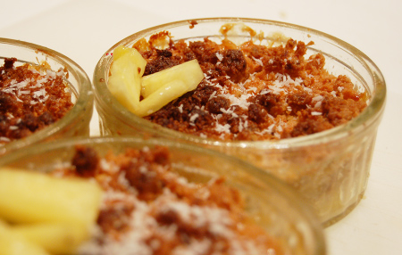
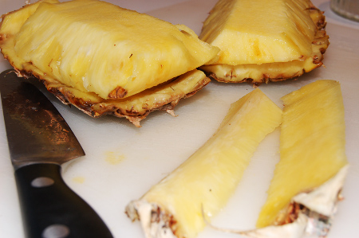
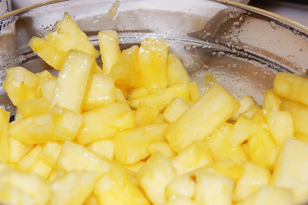
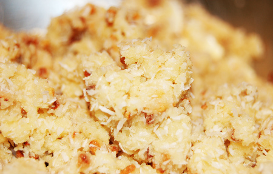
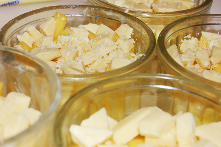

Quand il faut absolument se motiver pour aller faire les courses, rien de tel que de planifier une recette gourmande. cette fois, un crumble exotique: noix de coco râpée, ananas frais, amandes et noisettes. On va encore s'empiffrer! Et bien non! La mode est aux petites portions, donc on se la joue mini-ramequins.

<!-- excerpt -->

Pour 10 mini-ramequins (non, on ne s'empiffre pas, on invite ses potes!)
<ul>
	<li>1 ananas</li>
	<li>100 à 150 gr de noix de coco râpée</li>
	<li>100 gr d'amandes en poudre</li>
	<li>80 gr de noisettes concassées ou de mélange brésilienne</li>
	<li>120 gr de beurre ramolli (en pommade)</li>
	<li>80 gr de sucre en poudre</li>
	<li>1 sachet de sucre vanillé</li>
	<li>1 pincée de sel</li>
	<li>100 à 200 gr de chocolat blanc (ici le fabuleux Galak)</li>
</ul>
Alors première chose importante, choisir son ananas. Il faut bien vérifier d'une part que la peau sent l'ananas, si ça ne sent rien c'est qu'il n'est pas assez mûr. D'autre part, il faut être sûr qu'il ne soit pas trop mûr et donc, regarder si les feuilles (hum?) tiennent bien au fruit. Si l'endroit où les feuilles sont attachées au fruit semble trop souple, c'est que le fruit est trop mou en dessous.

On commence par éplucher l'ananas. Comment faire? On lui coupe la tête (les feuilles), on le coupe en quatre dans le sens de la hauteur, on enlève l'espèce de trognon un peu plus dur que la chair et qui a moins de goût. Puis, comme pour un melon, on passe le couteau entre la chair et la peau. Puis on coupe en petits morceaux. Pour cette recette, on laisse reposer les morceaux avec le sachet de sucre vanillé et une pincée de sel, le tout bien mélangé.

On beurre ensuite les ramequins

Dans un cul de poule, on mélange le beurre en pommade, le sucre, la farine, la poudre d'amandes, les noisettes concassées et la noix de coco. On mélange tout cela du bout des doigts afin d'obtenir un mélange granuleux. Si c'est trop mou, il ne faut pas hésiter à rajouter de la noix de coco, un peu de farine et de la poudre d'amandes pour assécher davantage le mélange.

On répartit ensuite les morceaux d'ananas dans le fond des ramequins (laissez-en de côté pour la déco). On hache très grossièrement le chocolat et on en met quelques bouts sur les ananas. On recouvre de pâte à crumble et hop au four préchauffé à 170-180 degrès (ou thermostat 6) pendant 20 minutes à mi-hauteur.

Après ces 20 minutes, on règle le four sur la fonction grill, on rapproche les ramequins du haut du four et c'est reparti pour 5 minutes, afin de caraméliser les crumbles.

Sortis du four, on les laisse refroidir, ou tiédir selon les goûts, puis avant de servir, on décore de quelques bouts d'ananas frais et de noix de coco râpée qu'on aura pris garde de maintenir de côté. On peut aussi se la jouer gourmands (beh oui quand même) et ajouter une boule de crême glacée.

C'est doux et fondant. L'acidité de l'ananas a complètement disparu. les goûts d'ananas, de chocolat blanc et de noix de coco se marient à merveille et les portions étant petites, rien n'est écoeurant.

La noix de coco et l'ananas sont évidemment ce qui donne de l'exotisme à ce crumble mais la plupart des fruits se prêtent bien au jeu. La base de la pâte à crumble est presque toujours la même: beurre, sucre, noisettes concassées, poudre d'amandes et farine (dans des proportions plus importantes car ici, la noix de coco remplace une partie de la farine et de la poudre d'amande pour sécher le mélange). Certaines pâtes plus simples ne contiennent quant à elle que du beurre (70gr), de la farine (100gr) et de la cassonade (60gr). Une fois qu'on a cela, on laisse libre court à son imagination, à ses envies et à sa gourmandise. Bon appétit!
