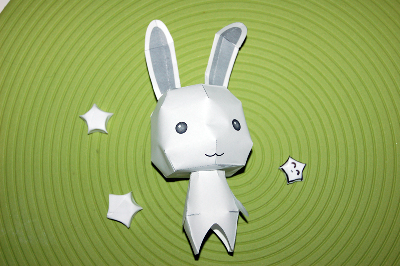
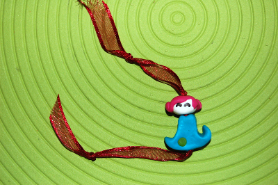
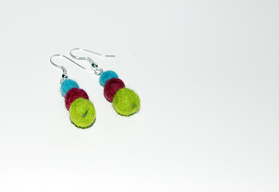
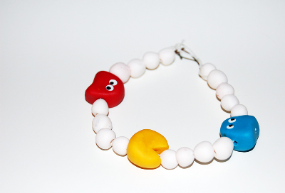
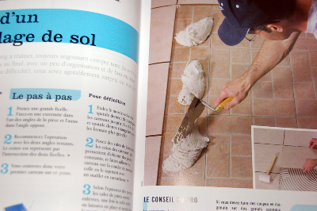
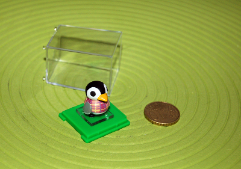

Eh oui... passage sur Wordpress,  et bientôt un nouveau thème qui va grave déchirer sa race (le coup de tronçonneuse comme dit Katsoura), l'homme de ma vie passe du temps sur son ordinateur. Certains se disent que la pauvre wii est abandonnée mais aucun ne se demandera comment la femme passe son temps dans les 69 m² innocupés (sur les 70 m² de notre appart, le dernier étant réservé à l'ordinateur, vous l'aurez compris). Quand l'homme est inaccessible, la copine de geek doit trouver des occupations.

Donc je joue à la wii. Mais pas uniquement.

<!-- excerpt -->

Plusieurs sensations sont à la page, en ce moment. Tout d'abord physique, douloureuse et complètement déculpabilisante face à la barre de chocolat que je suis incapable de ne pas m'enfiler entièrement : je me suis inscrite à la gym. [Thélème sport](http://www.thelemesport.be/centredefitness.html), une salle remplie de mâles façon Prison Break machines de torture. Pour environs 30 euros par mois, j'ai accès aux exercices de tonification musculaire, aux machines cardio (vélo, elliptique, tapis roulant, step, etc.) et aux cours collectifs : body balance (détente, souplesse, relaxation et renforcement musculaire), body pump (avec des haltères), body step (avec le stepper), body combat (fitness avec des mouvements de sports de combat), renforcement des abdos pendant une heure (ou comment souffrir en groupe), et RPM (vélo en musique). La salle est ouverte en semaine de 17 à 21h30 ainsi que quelques bonus les mardis, jeudis et samedis matins, donc pas d'excuses pour ne pas trouver de moyen d'y aller (de toutes façons, c'est payé pour un an, donc Ced m'y envoie de force si je me démotive)

Autre sensation, tactile, celle là. Je me suis mise au bricolage manuel. Du [lapin](http://kids.nifty.com/handmade/paper/animal/02/index.htm) et des [étoiles en papier](http://hkcreativity.canalblog.com/archives/2006/06/28/2190812.html#comments) à la pâte fimo en passant par le tissage de laine bouillie... J'ai adoré [les Miniboozes de Laetitia](http://powpowpow.canalblog.com/albums/miniboozes**_/index.html) (mais je n'ai pas son talent). J'ai aussi fait des boucles d'oreilles (offertes à ma belle soeur) et plein de petits brols.

Sensation musicale, j'ai découvert [Mika](http://radioblogclub.com/open/131803/mika/Mika%20-%20Grace%20Kelly), que je connaissais sans le savoir. J'adore plus particulièrement "Grace Kelly" que je peux écouter en boucle jusqu'à l'épuisement. Ced aime aussi donc ça va.  J'adore les [Tellers](http://radioblogclub.com/open/80435/tellers/the%20tellers%20-%20second%20category) aussi.

J'ai acheté un bouquin pour apprendre à bricoler dans la maison: la pose du carrelage, du parquet et les techniques de peinture n'ont plus de secret pour moi. Reste à avoir le permis de bâtir (on a quelques soucis de ce côté là...) et je mettrai ces nouvelles connaissances en pratique. Mouhahahaha. Pour le barbec géant de pendaison de crémaillère, ce sera plutôt une fondue géante, ou une pierrade ou qqchose qui peut se faire à l'intérieur, parce qu'au train où ça va, la maison ne sera pas finie avant l'hiver (on espère qu'elle sera commencée...)

Et last but not least, j'ai reçu de mon frère un mini personnage Animal Crossing et du coup, manie du moment, j'ai envie de me construire le village tout entier (beh quoi)

