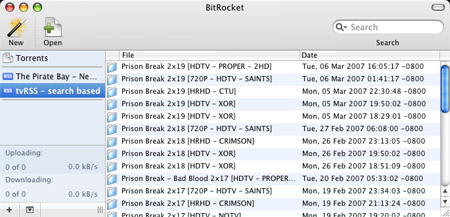

C'est déjà arrivé à la plupart des geeks fans de séries télé américaines. Le lundi matin vous arrivez au boulot et vous entendez  vos collègues dire que **** peut traverser le feu sans la moindre égratignure  ou que **** a enfin ouvert la trappe. Et oui, c'est la _loose_ totale, on dirait que vous avez quelques épisodes en retard dans vos séries favorites.

Bon ok, vous l'avez l'excuse du manque de temps. C'est clair qu'aller sur le classique [epguides.com](http://www.epguides.com) et tout ça, ça prend du temps. Les [RSS Episode Alerts](http://www.emich.be/fr/2006/11/09/rss_pour_series_tele/) de Mich sont déjà bien plus pratiques, mais là encore il faut passer son temps à trouver le bon fichier à télécharger. C'est bien connu, le geek est paresseux.

<!-- excerpt -->

Je me disais que l'idéal serait d'avoir un flux RSS avec ses séries favorites directement dans son client BitTorrent. Et bien comme souvent sur Internet ça existe. [Wired](http://www.wired.com/news/infostructure/0,1377,62651,00.html) en parlait déjà en 2004. Ca porte même un nom : le [broadcatching](http://en.wikipedia.org/wiki/Broadcatching).

Le site de référence dans le domaine semble être [tvRSS](http://tvrss.net/). Le principe est simple, on ajoute par exemple [le flux de la série Prison Break](http://tvrss.net/search/index.php?show_name=Prison+Break&amp;show_name_exact=true&amp;mode=rss) dans un client BitTorrent gérant le RSS, comme [µTorrent](http://www.utorrent.com/rsstutorial.php), [BitRocket](http://www.bitrocket.org/) ou [Azureus via un plugin](http://azureus.sourceforge.net/plugin_details.php?plugin=rssfeed)... _et voilà_. Fini les recherches fastidieuses.

En combinaison avec [les flux de sous-titres en français d'Alconis](http://www.alconis.com/dotclear/?soustitres), on se demande bien ce qu'il reste aux compilations d'épisodes ayant 2 ou 3 saisons de retard et vendues à prix d'or par les distributeurs (également connues sous l'appellation marketing de _coffret DVD_).
