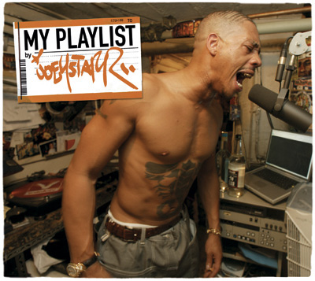

Je n'aime pas le rap français. Des Diam's, des Sinik, ça m'horripile, et puisque c'est eux qui représentent le rap français, alors je n'aime pas le rap français. Les geignards de la téci qui se plaignent de ne pas toujours avoir eu la BM qui déchire sa reum la tepu.. non non non pas pour moi. Il faut assumer son combat et ces geignards qui se disent qu'ils vont tout claquer parce qu'ils ont prononcé le mot "police" ou le mot "sarko" deux fois dans la même phrase, alors là non....

Assumer on a dit.  Du fort, du  Jaguaaaarr (attention, Soph devient hystérique) et c'est comme ça que l'album solo de Joey Starr (si vous n'aviez pas encore compris de qui je parlais) passe en boucle depuis que nous avons décidé d'aller le voir en concert à Bruxelles ce - 2 - avril - qui - va - venir - bientot - dans - 2 - semaines. Pourquoi il passe en boucle? Pour imprégner les oreilles et le cerveau de Ced de toutes ces belles paroles, bien sûr. Et pour dire de bien s'amuser, on a invité [Nico et Méla de Xide](http://blog.xide.be/index.php/) à venir avec nous.

<!-- excerpt -->

Allez, on est sympa, on vous racontera.

[Le site de Joey Starr](http://www.gare-au-jaguarr.com/) (attention, site merdique) et [Wikipedia](http://fr.wikipedia.org/wiki/Joey_Starr) pour en savoir plus.
