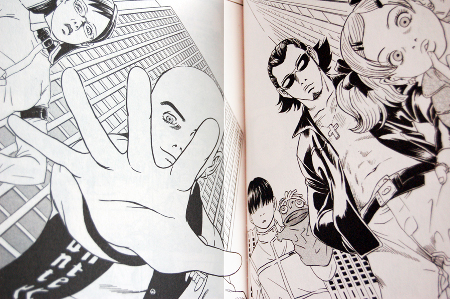
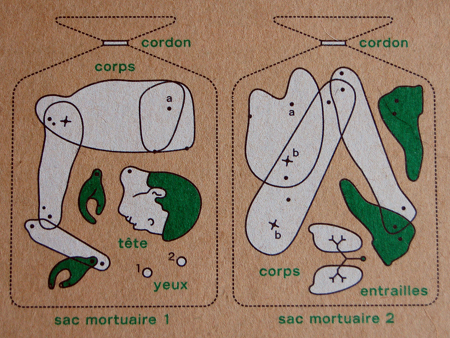
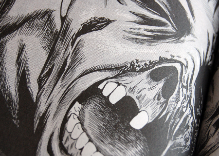
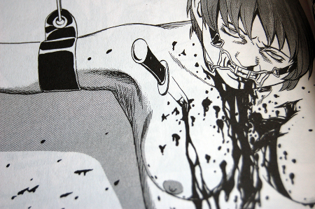
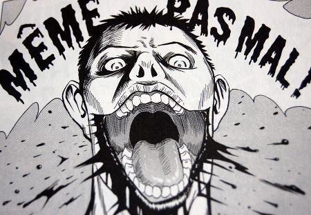

Gros coup de coeur manga ce w-e. Ced m'a acheté les 4 premiers tomes de Kurosagi Livraison de cadavres (merci mon amour)

Pour résumer très brièvement, un groupe de jeunes se met en tête de retrouver des cadavres et faire leur dernière volonté. Dans ce groupe, on rencontre Numata, un sourcier qui au lieu de trouver de l'eau, trouve les cadavres grâce à son pendule, Makino, une embaumeuse de talent, Yata, un garçon qui a la capacité de communiquer avec les extraterrestres via une marionnette, Sasaki, une demoiselle qui n'a pas son pareil pour retrouver des informations à partir d'indices apparemment anodins, et surtout Karatsu Kuro un télépathe sans qui la communication avec les cadavres ne serait pas possible. Il lui suffit de mettre la main sur eux pour les entendre parler. Les cadavres souhaitent parfois être simplement transportés dans un endroit calme pour leur dernier repos. Parfois, leur volonté est plus complexe et ils souhaitent retrouver leur meutrier, ou encore réunir les morceaux éparpillés de leur corps, ou retrouver l'âme de leur petite amie qui a dû se suicider quelque part le même jour mais qui est maintenue en vie par un père incestueux, etc. etc. Si l'histoire en elle-même a toujours le même fil conducteur, les scénarii sont assez variés. Les dessins, malgré qu'ils ne sont pas réputés pour être exceptionnels, me plaisent beaucoup. Cette ambiance morbide et parfois gore me plait aussi. C'est clair que ça me change de [Chobits](http://www.pika.fr/pika_ficheserie.php?id=30) ou de [Love Hina](http://www.pika.fr/pika_ficheserie.php?id=18)...

Quelques images dans la suite...

<!-- excerpt -->

C'est chez [Senpai](http://www.senpai.fr/), le côté adulte de [Pika](http://www.pika.fr/)

Le [5eme](http://www.amazon.fr/exec/obidos/ASIN/2845996985/64kleblodesop-21) (le dernier de la série) est déjà paru mais je ne l'ai pas encore...
