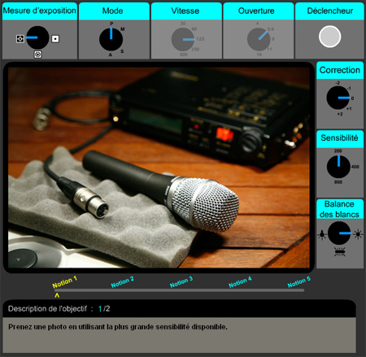

Vous vous souvenez de [Cadrez-moi](http://www.utc.fr/rendezvouscreation/francais/connaissances/outilspedagogiques/cadrezmoi/files/)? Ce jeu qui présentait les grandes règles du cadrage en photographie avant de proposer de cadrer un plan, et donner des points selon la compréhension de la règle. Nicolas Esposito, l'auteur du blog [RendezVousCréation](http://www.utc.fr/rendezvouscreation/francais/), m'a envoyé [Déclenchez-moi](http://www.utc.fr/rendezvouscreation/francais/connaissances/outilspedagogiques/declenchezmoi/files/) son nouveau jeu pédagogique qui propose cette fois les grandes règles (mais incontournables celles là) de la vitesse d'obturation, d'ouverture de diaphragme, de sensibilité à la lumière, de balance des blancs, etc. Cela fait 8 mois maintenant qu'on a l'appareil, donc ces règlages, j'ai fini par les connaitre. Mais j'avoue que j'ai toujours eu un peu de mal avec "la grande ouverture c'est un petit chiffre, c'est une petite profondeur de champs et c'est beaucoup de lumière" Logique oui, mais en pleine nature quand il faut (parfois) se dépécher de règler l'appareil pour ne pas rater un insecte et qu'au final on se rend compte qu'on a inversé le réglage et qu'on a du flou juste où il ne fallait pas... Ca ne fait donc pas de mal de se remettre tout ça en tête.

Pour une personne qui vient d'acheter l'appareil, qui tremble déjà devant tous les boutons et qui s'évanouit carrément devant l'épaisseur du bouquin d'explications, ce jeu est idéal.

<!-- excerpt -->

Donc en résumé, il y a une photo d'un micro et de son arrière-plan, une règle est énoncée genre "Plus la vitesse d'obturation est rapide, plus le mouvement sera figé " (en plus détaillé et mieux expliqué que ça évidemment)  et une consigne suit, du genre "En mode vitesse, obtenez le plus de flou possible sur le ventilateur". Là il faut régler les bouton qui encadrent la photo et déclencher. Selon le réglage, vous aurez une appréciation et des points;

Bon amusement (et je préviens Nicolas que j'ai blogué son jeu, comme ça il pourra tenir compte de vos commentaires pour les prochaines versions)
