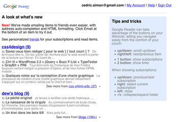

Google vient de lancer [Wii Reader](http://www.google.com/reader/wii), une version de son lecteur de flux spécialement conçue pour la Wii, la Wiimote et l'affichage sur un téléviseur.

Idéal pour lire ses blogs favoris, vautré dans le canapé ^-^

<!-- excerpt -->

