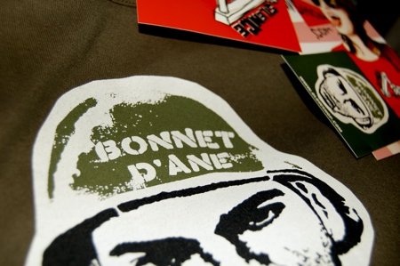

Je deviens une fashion-web-victim. J'avais commandé ce week-end un tshirt sur Olowshop et le voila déjà...

Olowshop est [une boutique de t-shirts](http://www.olowshop.com/) à messages engagés. J'ai préféré "[Bonnet d'âne](http://www.olowshop.com/tshirts/girl/bonnet-dane-p-64.html)". J'avais assez bien hésité avec "[Livraison à domicile](http://www.olowshop.com/tshirts/girl/livraison-domicile-p-60.html)" dont le motif représente un largage de bombes par un avion. Rien que du bon sur ce site. Olowshop est aussi un [blog](http://www.olowshop.com/blog.php) et un espace d'[expression libre](http://www.olowshop.com/boutique/expression_libre.cfm)... à découvrir. Les créateurs sont les meilleurs amis du monde et m'ont semblé particulièrement sympas lors de notre petit échange de mails.

<!-- excerpt -->

Une adresse à retenir donc, parce qu'un beau t-shirt, c'est bien, mais quand il véhicule un vrai message, c'est encore mieux! (vais passer pro en slogans qui puent). Allez plus sérieusement : le t-shirt engagé, le petit prix, le service rapide, la sympathie des vendeurs et les petits stickers en cadeau.... que du bon, je vous dis!
