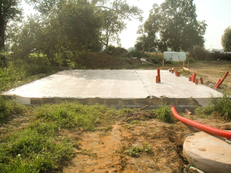

Un petit billet perso en passant, histoire de donner des nouvelles de notre construction. C'est fou ce qu'il peut y avoir de travail avant une dalle de sol. Je pensais naïvement  à un simple coffrage rempli de beton... Résultat: avant de faire une dalle de sol, il faut des tranchées, des tuyaux, des blocs de beton, du sable..... et encore, on ne fait pas de cave!
La dalle est faite depuis mercredi passé et là elle sèche quelques jours avant qu'on puisse commencer à monter les murs avec des blocs de terre cuite, l'isolant et la brique de parement.

Pour l'instant ça me parait dramatiquement petit. La maison du voisin, en construction elle aussi, me paraissait également petite lorsqu'il n'y avait que la dalle (pourtant, elle fait 5 m de plus que la notre en longueur, mais elle est de plain-pied). Maintenant qu'elle est finie (il ne leur reste que l'intérieur et les menuiseries), elle me parait énorme.

<!-- excerpt -->

Pour des questions de budget, nous n'avons pas pu mettre de panneaux solaires ni de chauffage par le sol. Ca aurait été possible s'il y avait moins de démarches administratives pour obtenir les primes de la région wallonne et surtout si ces primes arrivaient avant de devoir débourser. Les euros se comptent en milliers quand on construit une maison et le prix monte très vite; Les solutions écologiques viendront avec le temps.

En attendant, nous avons la chance que tout le pan gauche de la maison soit au sud. Nous avons mis un maximum de fenetres de ce coté là (y compris des fenetres de coin pour ne manquer aucun moment d'ensoleillement) et réservé le mur opposé aux petites pièces (les toilettes, le hall d'entrée et la buanderie). Le but étant de faire entrer un maximum de chaleur la journée (donc par le sud) et de bloquer l'air plus frais des zones au nord. Ca nous permet d'avoir une seule pièce principale en L, comprenant le salon, la salle à manger et la cuisine (dans le bout du L) Cette pièce sera seulement coupée au milieu par la cage d'escalier.

Question isolation, nous avons également mis le paquet, avec 10 cm d'isolant au lieu des 5 cm prévus par l'entrepreneur. Pour le chauffage, nous avons donc opté pour leur solution, non écologique mais qui sera peu utilisée, un chauffage électrique indirect dans les pièces de vie (l'électricité est consommée la nuit pendant le tarif réduit et la chaleur est restituée la journée) et des chauffages directs dans la salle de bain et les chambres. Le chauffage électrique peut être couteux s'il est utilisé non-stop mais vu l'isolation, la taille et l'orientation de la maison, il faudra déjà un hiver bien frisquet pour qu'on soit obligés de surconsommer. En plus, nous avons prévu d'installer un chauffage au bois, et cela sans construire de cheminée. Il y aura donc une buse qui traversera la maison sur sa hauteur (qui passera par la buanderie au rez de chaussée et dans la salle de bain à l'étage). Lorsque nous allumerons la cheminée, la chaleur diffusée par le poêle et par la buse sera suffisante pour chauffer toute la maison, étage compris.

J'aimerais, avec le temps, que la maison soit aussi passive que possible, donc il arrivera sans doute un moment où nous mettrons ces vitres super-isolantes qui captent et restituent la chaleur solaire (pour profiter pleinement de la grande surface de vitrage que nous avons). Je pense qu'il existe même des vitres qui s'assombrissent et fonctionnent comme un thermostat. Et puis comme je le disais plus haut, opter pour l'écologie (et du coup, la consommation à moindres frais) avec des panneaux solaires. Il serait temps que les quelques sièges gagnés par les écolos nous servent à quelque chose. Les maisons passives coutent 10% de plus qu'une construction normale et ne sont donc accessibles en ce moment qu'aux gros budgets. Je pense qu'il est essentiel que les primes pour les constructions écologiques soient plus accessibles, offertes par exemple avant de devoir payer les matériaux, ou octroyées sous forme d'une réduction sur ces matériaux. Il y a encore du chemin à faire!

Bah.. on y est au moins pour 30 ans!

[D'autres photos de la construction dans  Flickr ](http://www.flickr.com/photos/64k/sets/72157600246073982/)
[L'habitat passif sur Wikipedia ](http://fr.wikipedia.org/wiki/Habitat_passif)
