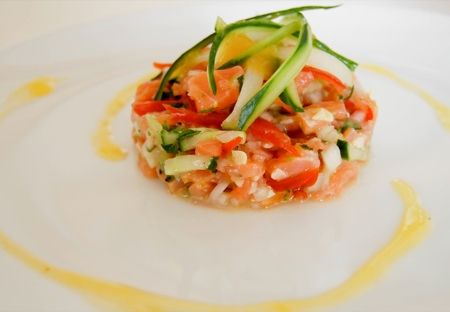
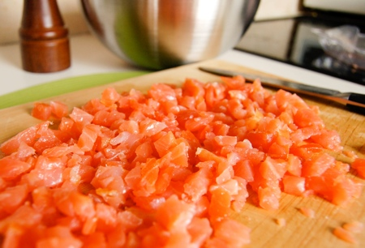
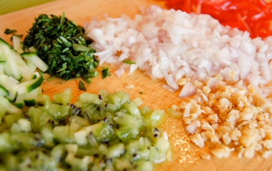
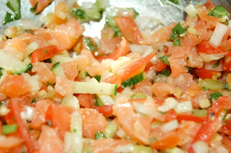
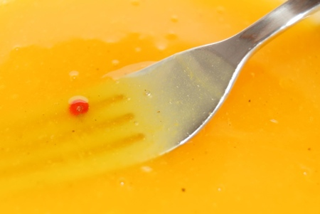
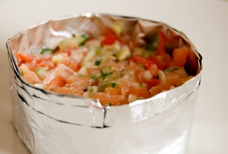

Je pense qu'en matière de poisson froid, c'est le thon rouge et le saumon qui ravissent le mieux nos papilles.  Ce n'est pas Ced qui dira le contraire. Il adore la recette que je propose aujourd'hui. Recette de mon cru, d'ailleurs! Point de bouquin à éclabousser dans la cuisine, point de recette à imprimer cette fois-ci. Recette de mon cru, mais motivée par le désir d'égaler une sensation rencontrée

Tout a commencé un jour où j'avais une grosse envie de frites, puis de spaghetti, puis de pizza (sans avoir mangé les frites ni les spaghetti, je précise) et nous nous étions alors retrouvés dans un restaurant italien. On s'attendait à un "petit italien", le genre qui propose des pizzas 4 fromages, des penne carbonara, avec un feu de bois pour cuire les pizzas, une chandelle sur la table et éventuellement du Ramazotti en boucle. Hé bien non, en passant devant le [Mulino Bianco](http://www.resto.be/ware/details.jsp?businessid=4754) et en voyant que pour l'heure, le parking n'était pas aussi rempli qu'aux autres endroits, nous ne savions pas encore où nous allions mettre les pieds (et les papilles).... Au programme : mobilier au design italien et personnages tout droit sortis d'un Coppola, parlant un italien bruyant et macho à quelques tables de là... C'est là que j'ai zappé la pizza et, goûté <strike>LE</strike> ZE tartare de poisson de ma vie, celui dont je n'ai jamais pu recréer la saveur, tant elle était subtile.

A défaut de [Mulino Bianco](http://www.resto.be/ware/details.jsp?businessid=4754) dans votre région (tout le monde ne peut pas avoir autant de chance que nous mouhahahaha), voila ce qui se rapproche le plus de l'orgasme culinaire de ma vie. Je me demande comment j'ai pu ne pas vous en parler plus tôt... par pudeur, peut-être ?

<!-- excerpt -->

Ingrédients pour deux personnes:
<ul>
	<li>150 gr de saumon fumé</li>
	<li>1 échalotte</li>
	<li>2 petites branches d'estragon</li>
	<li> 6 tomates cerises</li>
	<li>une 30aine de pignons de pin grillés et refroidis</li>
	<li>1/2 kiwi</li>
	<li>5 cm de concombre avec la peau</li>
	<li>1/2 citron vert</li>
	<li>de l'huile d'olive</li>
	<li>2 oranges bien juteuses, bio c'est encore mieux</li>
	<li>2 cuillers à soupe de sucretrès fin</li>
	<li>1 belle cuiller à soupe de maïzena</li>
	<li>quelques grains de poivre rose</li>
	<li>du poivre du moulin</li>
	<li>1 clou de girofle</li>
	<li>pas de sel!</li>
</ul>
Grillez les pignons de pin jusqu'à ce qu'ils soient dorés puis laissez-les refroidir complètement.

Hachez le saumon en mini-cubes.

Emincez l'échalotte, l'estragon (rien que les feuilles, pas les tiges), les tomates (épépinées au préalable), le kiwi, les pignons de pin et le concombre. Pour le concombre, faites ça bien pour que ce soit joli.

Mélanger le tout avec le saumon, ajouter un beau trait de jus de citron vert, quelques tours du moulin à poivre et un fin filet d'huile d'olive. Pas de sel, le saumon est assez salé. Mélangez encore et réservez au frais.

Pressez deux oranges bien juteuses et faites chauffer sur feu vif. Avant que ça ne commence à bouillir, enlever deux cuillers à soupe du jus chaud et mélangez-y la cuiller de maïzena. C'est plus simple d'intégrer la maïzena à une petite quantité de liquide qu'à une grande, ça évite les grumeaux. Mélangez à la fourchette et quand ce petit mélange est bien lisse, ajoutez-le au reste du jus. Laissez bouillir quelques secondes, le temps que la maïzena fasse son travail et que le jus s'épaississe. Ajoutez 3 grains de poivre rose et un clou de girofle. Enlevez du feu et laissez infuser 5 minutes. Versez ensuite cette sauce à l'orange dans un bol, enlevez le poivre rose et le clou de girofle et ajoutez doucement l'équivalent de 2 cuillers à soupe de sucre très fin. Mélangez et réservez au frais pendant une bonne demi-heure.

Dressez sur une assiette selon votre préférence. Pour un tartare, je trouve que ça donne bien d'avoir de belles formes (plutot qu'un petit tas au milieu de l'assiette). Si comme moi vous n'êtes pas équipés d'un cercle de dressage, fabriquez-le avec du papier alu. Remplissez le cercle et tassez bien pour que ça ne tombe pas quand vous l'enlèverez.

Enlevez délicatement et donnez ensuite du volume avec ce qui vous tombe sous la main. Ici, j'ai fait des spaghetti de concombre. Il suffit de faire des coupures bien droites sur la longueur du concombre et de passer ensuite le "rasoir à légumes". Je n'avais plus énormément de concombre, donc mes spaghetti sont assez courts, mais sur un concombre entier, il est possible de faire de longs spaghetti bien souples.

Nappez ensuite d'un peu de sauce à l'orange (pourvu qu'elle soit bien refroidie) et servez le reste de la sauce à part. Servez tel quel en entrée. Par contre pour un plat principal léger, accompagnez d'une jolie salade de roquette (sans épice, la sauce à l'orange suffira) ou de riz complet présenté en quenelles.
