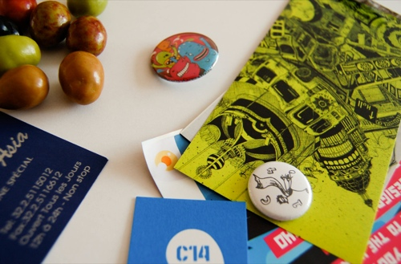
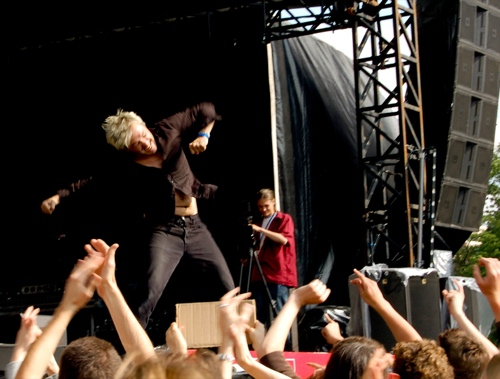

Chouette petit après-midi à Bruxelles hier, pour les fêtes de la musique. Au programme, petit coucou au pique-nique organisé dans le parc Royal où nous avons échangé quelques mots et grignoté avec [Vinch](http://www.vinch.be/blog/), [Mich](http://www.emich.be/), [Céline](http://www.tribbes.com/boutique/liste_produits.cfm?type=1&amp;code_lg=lg_fr), [Sandy et la charmante Zoé](http://www.kezako.be/shop/index.php), [Veuch](http://www.veuch.be/), [Gilles](http://www.lostmybike.com/templates/home.php?page=1) et [Sophie](http://www.lafraise.com/contest.php?op=lafraise_shop) (je n'ai pas reconnu les autres sorryyyy :-/). On a reçu quelques cadeaux de [Carbone14](http://www.carbone14.be/blogv2.aspx) et [Kezako](http://www.kezako.be/shop/) (merciii!)

<!-- excerpt -->

Puis direction la Place Royale pour ne pas rater le concert de [Sharko](http://www.sharko.be/). (pour la 3ème fois mais je ne m'en lasse pas)

Puis ballade en ville avec [Nico et Méla](http://blog.xide.be/) juste avant la fermeture des magasins (on a quand même su acheter des olives en chocolat à la [Cure Gourmande](http://www.cure-gourmande.com/)), grosse déception car l'album de Sharko était en rupture de stock à la Fnac (du coup je viens de l'acheter sur l'iTunes Store), et enfin un bon resto asiatique à St Géry.

Voila voila, au début j'étais pas trop emballée de sortir parce qu'on prévoyait de la pluie et j'étais dans le gaz à cause du boulot (grrrr bosser le week-end, quelle torture!)... mais le soleil était de la partie, j'ai rencontré des gens sympas, j'ai vu Sharko... j'ai bien fait de me laisser embarquer à Bruxelles hier aprem ^^

Quelques photos du concert sur [notre compte Flickr](http://www.flickr.com/photos/64k/sets/72157600461104759/)
