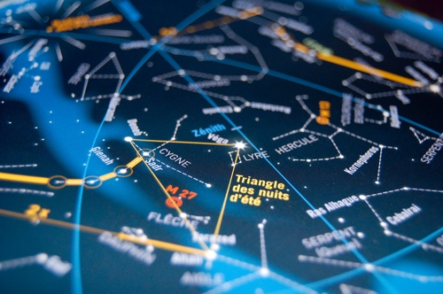

Quand certains dorment déjà ou se bourrent la gueule, nous avons passé une nuit dans le froid et l'humidité des hauteurs de Spa.

Nous avions rendez-vous avec les amateurs de l'infiniment grand. et p....... qu'est-ce que c'est grand! C'est même carrément inimaginable tellement c'est grand... On contemple le passé, parce que ces étoiles sont tellement lointaines qu'on ne les voit qu'après plusieurs années, le temps que leur lumière arrive jusque nous! Peut-être que les 3/4 des étoiles que nous avons vues sont déjà en fin de vie, en train d'exploser, mais on les voit toujours comme quand elles étaient jeunes. C'est terrible!

<!-- excerpt -->

En gros, la Terre traverse tous les ans, à cette période-ci de l'année, un essaim de poussières et de petits cailloux qui se désintègrent en rentrant dans l'atmosphère, à une bonne centaine de kilomètres du plancher des vaches. Ils s'enflamment et on peut les voir pendant quelques secondes. Je n'avais jamais vu d'étoile filante, et bien c'est chose faite. J'en ai vu 2. Une Perséïde, du coin de l'oeil, j'ai failli la rater, et une autre qui ne venait pas du même coin et qui était terriblement moins rapide. J'ai failli oublier de faire un voeu. On avait prévu le pied et l'appareil photo mais comme on avait l'air con à côté des énormes téléscopes, on n'a rien sorti. On était un peu tentés d'allonger le 70-300 au maximum et de lui mettre son pare-soleil pour qu'il fasse encore plus grand, mais je crois que tout ces passionnés n'auraient pas été dupés.

Nous avons rencontré un homme qui a construit son téléscope lui-même et qui nous a raconté le ciel avec énormément de passion et encore plus de patience devant mes "... Et la grosse qui brille fort, là?" "Ah ça c'est Jupiter" Parce oui, on a vu Jupiter. On dirait une grosse étoile qui brille fort et en fait c'est une planète. C'est fou la vie quand même! Ce monsieur nous a montré Jupiter avec son atmosphère et ses 4 satellites, il a même poussé le vice jusqu'à nous dire les noms des 4 satellites! Il nous a aussi montré d'autres galaxies (dont [Andromède](http://www.presencenet.be/nucleus2.0/media/10/20070727-M31.jpg)!), des nébuleuses, une super nova, [un amas globulaire avec un million d'étoiles dedans](http://www.presencenet.be/nucleus2.0/media/16/20070502-M3_Fiche_oj.jpg)... Il nous a expliqué les repères à prendre pour retrouver telle ou telle constellation et nous savons maintenant où se trouve le Triangle des Nuits d'Eté (comme c'est poétique!), du coup on sait où se trouve le Cygne, la Lyre, l'Aigle, le Dauphin, Hercule... J'étais déjà impressionnée par le ciel quand je sautais en parachute mais là c'est carrément le vertige!

En tout début de nuit, c'est possible de voir l'ombre de la terre sur le ciel, on se retrouve avec un gros cercle plus foncé qu'on distingue assez bien du reste du ciel un peu plus bleuté, c'est très impressionnant! Nous avons rencontré Véga (c'est une des premières qu'on voit le soir, qui se ballade toujours du côté du Zénith, donc juste au dessus de nos têtes), Acturus et Antarès, nous avons appris pourquoi les étoiles scintillent et nous avons tenté de contempler des "objets" (c'est comme ça que disent les pros!) comparables à de la dentelle.  Nous avons même vu passer la Station Spatiale Internationale! Enfin du coup on a un peu l'air con avec nos photos de macro mais bon...

Le plus gros de l'essaim des Perséïdes (qu'on appelle comme ça parce qu'elles semblent toutes partir de la constellation de Persée) sera traversé cette nuit (du 12 au 13) mais ça me semble bien parti pour être nuageux... L'idéal, pour bien les voir, c'est de s'allonger avec pull à col roulé, grosses chaussettes, transat et couvertures, regarder vers le Nord-Est et attendre le spectacle. Il faut que la nuit soit bien noire (le mieux c'est quand il n'y a pas de lune, comme c'est le cas la nuit prochaine) et qu'il n'y ait pas non plus de lumière au sol. En plein milieu d'un champ c'est l'idéal. Bill Cooke, de la Nasa, estime qu'au pic de l'essaim (juste avant l'aube du 13 aout), on pourra voir 1 à 2 étoiles filantes par minute! On pourra même voir Mars, juste en dessous de Persée! Il y a [un superbe article](http://www.cidehom.com/science_at_nasa.php?_a_id=287) qui sent la passion à des kilomètres à la ronde et il faut absolument que vous le lisiez, et si après ça vous n'etes pas la nuit prochaine, en pleine campagne en train de chercher les étoiles entre les nuages, je n'y comprends plus rien. Nous, on sera en direction de la Haute-Normandie pour pêcher le bigorneau avec [Marc](http://metroidmaster.com/index.php)... on s'arrêtera sûrement en route!

De très belles photos de galaxies, de nébuleuses, etc. sur le site du [Groupe Astronomie de Spa](http://www.presencenet.be/nucleus2.0/?catid=2). Dans le courant de la journée, il y aura sans doute des photos du ciel de la nuit dernière!
