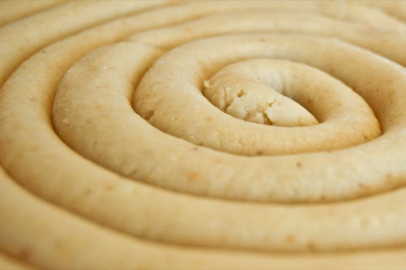

Il est surprenant qu'un bout de massepain, l'incarnation culinaire de la douceur (après le chocolat) ne soit composé que de 3 ingrédients.

<!-- excerpt -->

**Recette du massepain** (un boudin d'un mètre de long sur 1 gros centimètre d'épaisseur)
<ul>
	<li>200 gr de sucre impalpable</li>
	<li>200 gr de poudre d'amandes (ou un mélange amandes-noisettes en poudre selon les goûts)</li>
	<li>1 blanc d'oeuf.</li>
</ul>
On met tout dans un saladier et on mélange d'abord à la cuiller parce que ça colle fort, ensuite avec les doigts... on malaxe, on malaxe.. et quand ça a une consistance de massepain, on en fait ce qu'on veut, des boudins, des petits carrés, des petites boules, on les roule dans le cacao, dans le sucre, dans ce qu'on veut, on sépare en plusieurs portions qu'on colore avec des colorants alimentaires et on laisse l'imagination faire le reste....

Vu la vitesse à laquelle il va disparaitre, je me suis contentée du basique boudin...
