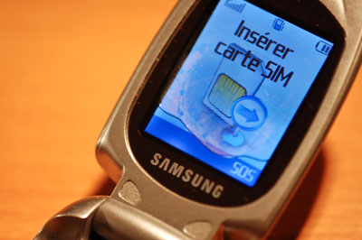

Je viens d'essayer de remettre la batterie dans le [Samsung X-480](http://64k.be/2005/08/03/samsung-x-480/) de Soph, en me disant "on ne sait jamais". Et bien il a l'air de fonctionner à nouveau, comme s'il n'avait jamais testé [le programme synthétique 60°](http://64k.be/2007/10/04/quelquun-a-une-idee/) de notre lave-linge.

<!-- excerpt -->

Bon d'accord, l'écran fait un peu aquarium, mais c'est original, non ? lol
