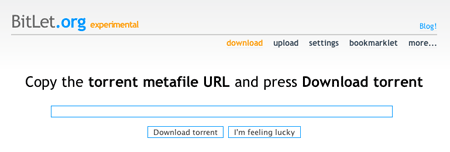

Je viens de découvrir [BitLet](http://www.bitlet.org/).

<!-- excerpt -->

Il s'agit d'un client BitTorrent accessible en ligne via une applet Java. Toutes les fonctions d'un client classique ne sont pas encore là, mais l'essentiel y est : téléchargement, partage, reprise et même envoi de nouveau fichier .torrent.

Il existe même un [bookmarklet](http://www.bitlet.org/more/bookmarklet) qui ajoute un lien pour télécharger directement via Bitlet sur les principaux moteurs de recherche des fichiers .torrent.
