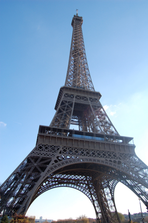
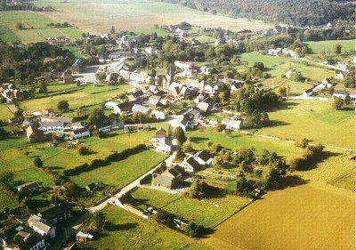
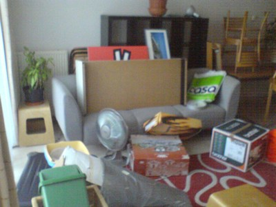
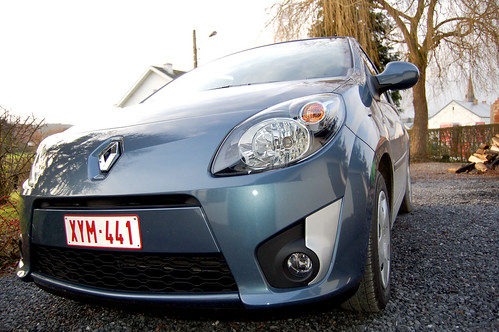

_"Cool une poule, comme dans Zelda!"_ (dixit Ced)
Ca me semblait une bonne intro pour  le petit billet d'aujourd'hui. Plein de choses à vous raconter parce que les choses ont bougé depuis notre petite escapade à Paris!

<!-- excerpt -->

]

**Paris Web, grève RATP et longue marche dans Paris**

Donc d'abord, parlons de la sus-dite escapade. C'était bien. J'ai eu mal aux jambes mais c'était bien. Pas beaucoup de métro et beaucoup de gens pour rentrer dedans alors du coup on passe son tour, une fois, deux fois, cinq fois, puis on essaie de rentrer dedans et on n'y arrive pas et à la septième fois, on a l'impression qu'il y a un type qui nous regarde en se marrant et donc on croit qu'on a l'air con et on préfère encore marcher. Cela dit j'ai visité, du coup. J'ai marché de la Gare du Nord à Chatelet, puis de Chatelet à l'hotel (près de la Bastille), puis de l'hotel à la Tour Effeil en passant par les Champs Elysées, puis de la Tour Eiffel à l'hotel en ne passant pas par les  Jardins du Luxembourg (pourtant j'avais envie), parce que les jambes n'en voulaient plus. Ca, c'était pour le premier jour.

Le lendemain, j'ai été voir quelques intéressantes conférences de [Paris Web 2007](http://2007.paris-web.fr/), à la Défense. Je me suis rendue compte que je comprenais l'anglais. Et le soir, plutot que de faire la file de 7m de large sur 25m de long pour rentrer dans le métro, j'ai préféré (avec Ced, cette fois), marcher de la Défense  jusqu'à l'hotel (toujours aussi près de la Bastille et aussi loin de la Défense). Le dernier jour je n'en pouvais plus. Nous sommes repartis bagages sous le bras jusqu'à la gare du Nord en traversant le Marais. Puis après nous être débarrassés des bagages, nous avons poussé le vice jusqu'à grimper les marches du Sacré Coeur à Montmartre et redescendre (toujours à pied) jusqu'aux Galeries Lafayette où j'ai eu le temps de faire un demi-étage (mais quand même acheter un petit pull parce que le mien me grattait) avant que Ced m'envoie un sms du style "on a fini le rayon multimédia, on t'attend en bas". Je n'étais que frustration. Frustration et douleur. Sinon c'était cool, j'ai vu la Tour Eiffel de jour et de nuit, j'ai marché sur les Champs Elysée (paaaaalampalalam au soleil, sous la pluie...), j'ai pris des photos dans la cour intérieure du Louvres, j'ai visité le musée d'Orsay, j'ai <strike>soupé</strike> dîné en amoureux près de la Place de la Concorde et tout ce qu'une touriste peut faire en 2 jours et demi sans métro. Bref, un petit 40 km à pieds, quand même.

Voila pour Paris.

**Fin du bail à Enghien, direction Bersillies-l'Abbaye**

De retour de Paris, nous arrivons à [Bersillies-l'Abbaye](http://fr.wikipedia.org/wiki/Bersillies-l'Abbaye),  qui est au petit patelin perdu ce que Paris est à la grande ville embouteillée en période de grêve des métros. Bersillies-l'Abbaye est loin de tout.

Quand j'étais petite et qu'on me demandait où j'habitais et près d'où c'était, je ne savais jamais répondre. Ou alors je disais "C'est près d'Erquelinnes", ce qui me semblait le plus ressemblant à une ville et le moins loin de la maison et je voyais le regard presque paniqué de mon interlocuteur qui semblait dire "Et ça, c'est près d'où?". Pour résumer, Bersillies l'Abbaye est entre Erquelinnes et Beaumont, à 40 km de Charleroi et 25 km de Mons, et est entouré à 80% par la France. La France est au bout de la rue, au bout de l'autre rue et au bout de l'autre rue aussi. Il y a une épicerie, deux cafés et un réparateur de trucs électroniques (quoique, c'est peut-être fermé maintenant). Il n'y a plus de boulangerie, et c'est tant mieux parce que le boulanger pétrissait la pâte avec un mégot dans le bec, un peu comme dans "L'aile ou la cuisse".

**Comme notre maison n'est pas encore terminée **

Pourquoi sommes nous à Bersillies l'Abbaye? Parce que le bail de l'appart à Enghien est terminé et que la maison par contre, ne l'est pas.

Donc, nous sommes gracieusement hébergés par ma môman jusqu'à ce que notre maison soit habitable. Elle héberge également nos meubles et nos caisses dans son garage et tout ce temps là, sa voiture dort dehors et risque sa vie (voir plus loin) Aux dernières estimations, on disait fin janvier. L'électricité est faite, le sanitariste vient lundi. On a tenté de mettre l'eau aujourd'hui mais la gaine est trop pliée et ne laisse pas passer les tuyaux. Donc on va devoir carotter, parait-il. Sinon après le passage du sanitariste, on plafonne, puis on met le carrelage (entre Noël et Nouvel an), puis pour le mois de janvier, il restera à mettre les caches sur les prises, le coffret électrique, la cuisine, la salle de bain et l'escalier. Puis on libèrera le garage de môman et on retrouvera notre petite vie de couple qui mange des crasses devant la tv et qui lave son linge tout seul. En attendant, on mange équilibré, à heures fixes et on dit à quelle heure on rentre. N'empêche, je ne vois pas bien ce qu'on aurait fait sinon.

**Twingo incendiée**

Bersillies l'abbaye est un patelin paumé, un bled perdu, un trou complètement oublié par les services de voirie. "_Comme ça doit être cooooool la vie à la campagne_" direz-vous. "_Tout le temps en vacances, la chance qu'ils on_t". C'est vrai qu'il y a des gens qui paient un gîte pour passer le week-end à la campagne, à proximité des fermes, des promenades, de l'herbe, des vaches, des poules, tout ça. Sauf que là il pleut, il fait froid, les routes sont dégueux, les rues sont remplies de chiens. Pas trop envie de promenade. Et puis, nous étions à Bersillies depuis à peine 2 semaines que [voila](http://www.flickr.com/photo_zoom.gne?id=2075315269&amp;size=l).

Pourtant, le coin n'est pas mal famé du tout. Il n'y a pas de coin mal famé à Bersillies, il y a des fermes, des fermettes rénovées par des ex-citadins, des villas et quelques maisons de série tout près de la place du village.

Du coup, [voila!](http://www.flickr.com/photos/64k/sets/72157603339658991/)

Après avoir réfléchi à qui pourraient être mes ennemis, nous sommes arrivés à la conclusion que brûler les voitures, c'est plutôt une zin de Français (sans racisme aucun, il suffit d'allumer les infos) et que comme nous sommes cernés, ce sont les petits caïds français de la région qui sont responsables. Si un jour je les tiens, je les castre avec un briquet. Ok, une voiture, c'est matériel, 2 voitures aussi (il y en avait une autre juste à côté de la mienne, carbonisée aussi), mais ils ont failli brûler la maison (les voitures étaient contre la porte de garage, les flammes léchaient la corniche) et si personne ne s'était réveillé, tuer 5 personnes et 2 chats (dont Félix, merde quoi!). Bref, après la peur de lundi dernier, je suis maintenant plutot révoltée contre ces putains d'enculés (_de français_ sans généralité, sans racisme et sans connotation négative envers tous les autres français, je parle juste de celui ou ceux qui sont passés devant la maison à 2h du mat, on cassé une vitre et ont balancé un cocktail molotov dans une voiture, ça va comme ça?) qui ont brulé ma voiture et ont failli nous tuer, ma famille et moi.

Il me reste plein de trucs à vous dire, je dois écrire un mot avec des pâtes pour [Dette](http://dette.wordpress.com/) et je tiens à parler du nouveau service  badge Do It Yourself de [Sandy](http://www.kezako.eu/bloguez_vos_badges-34.html) mais je ferai ça une prochaine fois...

Et bravo à ceux qui ont tout lu, au fait!
