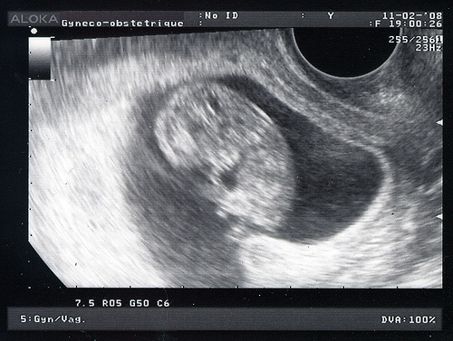
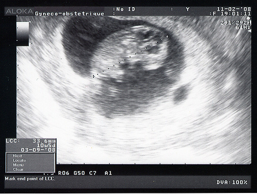

ou 10 sa et 5 jours...

<!-- excerpt -->

Qu'est ce que tu as grandi! Tu vas bien, ton coeur bat, je l'ai vu, je l'ai entendu. Je t'ai vu bouger et je ne stresse plus. Tu mesures 3,6 cm! On voit bien ton profil, ton coeur en plus foncé sous le menton. Le gynéco a mesuré ta nuque et elle est toute fine, ça limite grandement le risque pour le syndrome de Down. C'est la trisomie, une maladie génétique. Je devrai faire d'autres tests dans une prise de sang pour m'assurer que tu n'auras pas cette maladie très grave qui déforme le corps, le visage et qui rend plus lent (un handicap mental brrr). Je suis déjà rassurée par la taille de la nuque. Ces risques augmentent en fonction de l'âge de la mère et des conditions de grossesse. Mais je suis jeune (28 ans, ça va non?), je ne bois pas, je ne fume pas, je ne me drogue pas. Je reste confiante. Je ferai la prise de sang assez vite.

