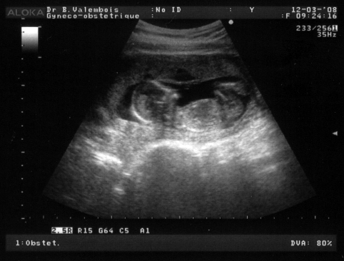
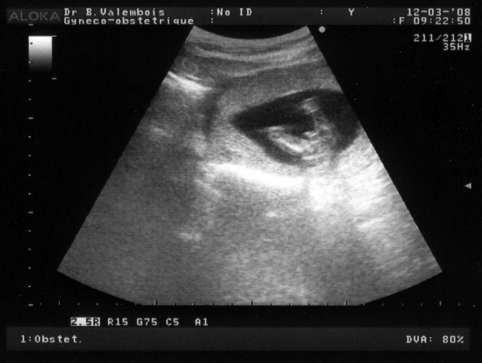

Je suis super heureuse et ton papa aussi, on vient d'apprendre que tu es un garçon! Ton papa est rassuré, il va pouvoir se remettre aux Lego, acheter un énorme circuit de train électrique et essayer de t'initier aux jeux vidéos...

<!-- excerpt -->

Dès que le gynéco a posé la sonde sur mon ventre, tu avais les jambes bien écartées et le zizi bien visible, aucun doute possible! Donc tu t'appelleras Elliott... C'est ça le bonheur!

Après, on a regardé ton profil, tu gigotes beaucoup mais le gynéco a réussi à prendre une superbe photo de toi...

Les petits soucis, les douleurs et les saignements sont normaux étant donné que je suis ultra constipée. Je me sentais moins constipée mais c'est juste parce que mes intestins se sont habitués à être élargis. Je dois boire 3 L d'eau par jour au moins.. Je ne bois vraiment pas tout ça pour l'instant, je crois que j'arrive à peine à 1 L mais à partir de maintenant je vais me promener avec des bouteilles d'eau!  Il faut aussi que je mange plus de fibres, donc des légumes verts, du pain complet, du riz complet, des pruneaux...

Tout va bien aller, c'est le grand bonheur!
