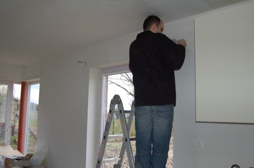

... C'est le printemps là maintenant... et c'est Pâques en plus! De la neige à Pâques et pas à Noël.. on aura tout vu!

<!-- excerpt -->

Sinon les choses suivent leur petit bonhomme de chemin... Ton papa et moi avons pas mal travaillé à la maison ces derniers jours. On la chauffe pour qu'elle sèche plus vite, on attache les tringles des rideaux, on s'est occupé de monter des petits éléments de rangement pour la buanderie...

On regarde les enfants et on se demande comment tu seras... Ce petit gamin à lunettes qui mange tranquillement ce qu'il y a dans son assiette? Celui avec la crête à la tektonik qui saute dans tous les sens autour de ses parents? Celui qui veut marcher tout seul loin devant ses parents avec son cartable pour prouver qu'il est grand? Celui qui pleure dans le magasin pour avoir des bonbons? Celui qui emmerde sa petite sœur et qui se marre quand elle lui crie "connard!"? Celui qui s'assied par terre dans le rayon livres?

Est-ce qu'on sera de bons parents? Est-ce que tu t'amuseras bien dans la maison? Est-ce que tu aimeras ta chambre? Est-ce que tu seras bon à l'école? Est-ce que tu seras toujours sur l'ordinateur ou tu iras jouer dehors? Est-ce que tu vas vite faire tes nuits? Est-ce que je vais savoir t'allaiter?

On sait seulement qu'on t'aime déjà comme des fous!
