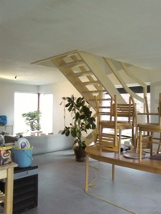

Voila voila, nous avons déménagé les meubles ce week-end.

Location d'une camionnette d'une capacité de 11 gros m3: 150 euros du samedi 17h au lundi 6h45, chez [Camion Location](http://www.camionverhuring.be/fr/home/index.asp). (avec les assurances et pour +- 300 km). A mon grand étonnement, les manoeuvres avec [cette camionnette](http://www.camionverhuring.be/fr/bestelwagen/detail.asp?ID=30) m'ont parues plus simples qu'avec ma Twingo. Allez comprendre....

Les meubles nous attendent patiemment, jusqu'à ce qu'on ait de l'électricité dans toutes les pièces (je me retiens de mettre un lien vers le site de l'électricien qui se fait attendre depuis des mois) et des carrelages dans la salle de bain.

Un petit aperçu avant de continuer en parlant du putain de chauffage au bois-charbon.

<!-- excerpt -->

D'ici là, on chauffe, ou plutot on tente de chauffer parce qu'on ne comprend plus rien à notre foutu poele, on va finir par se dire qu'**on a fait une connerie de tout miser sur le chauffage au bois ou au charbon**. Ca a très bien fonctionné depuis qu'on l'utilise et ce week-end, le bois avait du mal à prendre et quand il était pris, il faisait + de cendres que de braises (mais ce n'était pas le même que d'habitude, c'était du bouleau cette fois, il me semble, et du chêne les autres fois) et le charbon éteignait le feu. On met le bois, on attend des braises et quand c'est bien rouge, on met un peu de charbon, pas trop pour ne pas étouffer le feu, mais juste ce qu'il faut pour que la chaleur soit plus forte...

Ouais... qu'on dit!  Ca a fonctionné comme ça pendant une demi heure, le temps que les dernières buches terminent de bruler et de remplir de le poele de chaleur. Ensuite, tout est redevenu noir et tiède. Pourtant nous avions acheté de l'anthracite. 37 euros pour 100 kg, qualité A, 20/30... enfin je ne sais pas si tout ça vous parle... Généralement, nous achètions des sacs de [Novantra](http://www.brico.be/wabs/fr/catalogue/p385631/charbon-novantra-25kg.do), chez Brico et ça allait tout à fait comme on lui demandait... mais il doit y avoir une pénurie, voila une semaine que le stock est vide. En avril, ça peut se comprendre mais il y a une semaine, il neigeait.. c'est pas ça qui sèchera la maison...

Enfin je passe un appel à l'aide, une requête désespérée, d'une voix sanglotante, si certains s'y connaissent en trémie, en charbon, en coke, en bois de chauffage et en [poele Dovre](http://www.dovre.fr/poele-multicombustible.asp?index=0&amp;pdc_id=9&amp;pro_id=55), qu'il se fasse connaitre et qu'il transmette sa science parce que là je commence à déprimer. Normalement l'anthracite c'est le meilleur du charbon, non? Des beaux cailloux très noirs et brillants qui rougissent et transmettent une chaleur de fou à courir tout nu en plein hiver... Enfin si c'est pour avoir 14 degrès dans la maison quand le poele est éteint depuis 10 minutes, alors non, les meubles peuvent m'attendre encore longtemps. On songe sérieusement à acheter des chauffages électriques, que ce soit momentanément à bain d'huile, en attendant le bon temps, ou investir dans des accumulateurs (un bon 800 euros par radiateur je crois!).

Enfin bref, à part ça, ça fait un bien fou au moral d'aménager notre maison, même si ce sont les mêmes meubles qu'à l'appart et que le style est un peu disparate (les meubles de l'appart de Ced à Bruxelles + ceux qu'on a acheté à deux pour Enghien).. il faudra qu'on harmonise tout ça, qu'on peigne les murs dès que tout sera bien sec... tout ça se fera petit à petit...  Plus on met de meubles et plus je trouve qu'on a plein de place!

Je ne sais pas si c'est mieux de vitrifier l'escalier en foncé (un peu comme [le plan de travail de la cuisine](http://www.flickr.com/photos/64k/2352134950/)) ou si c'est mieux de tout garder clair. J'aime bien la couleur du bois tel qu'il est en ce moment mais ça fera peut-être trop clair justement... puis il faudrait une certaine harmonie entre les couleurs de bois mais je n'ai pas envie de tout avoir de la même couleur que la table, je trouve que ça fait un peu "kot", cette couleur. Ou alors on ponce les bois et on les met en clair... Il y a aussi un budget à prévoir pour l'aménagement de l'extérieur: remettre le terrain plus ou moins plat, mettre des bordures, planter des buissons et surtout, le plus urgent, mettre du gravier autour de la maison. Pour l'instant, c'est boueux et la maison est constamment dégoutante.

Bah, plus que 29 ans à payer, on a encore le temps pour les travaux...
