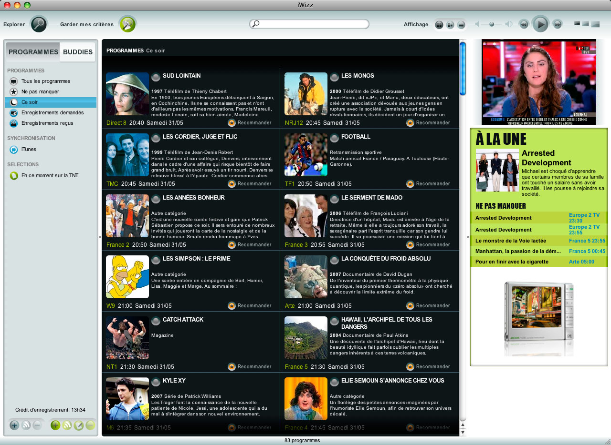

Vous vous souvenez encore de [Joost](http://fr.wikipedia.org/wiki/Joost) ? Un truc vidéo qui était encore _hyper tendance_ en 2007, avec [des invitations pour la beta privée](http://www.emich.be/fr/2007/05/02/999-invites-joost-a-donner/) et tout et tout. Mais entre les Sport Illustrated Swimsuit et autres World Poker Tour, le contenu n'a jamais été vraiment à la hauteur.

La startup [Wizzgo](http://www.wizzgo.com) a eu une idée à la fois simple et géniale : proposer un magnétoscope numérique permettant d'enregistrer n'importe quel programme disponible sur la TNT française. C'est à dire
TF1, France 2, France 3, France 5, M6, Arte, Direct 8, W9, TMC, NT1, NRJ12, LCP, France 4, BFM TV, i&gt;TELE, Virgin 17 et Gulli. Ce qui est tout de suite beaucoup plus intéressant niveau contenu ^-^

Tout ceci fonctionne avec le logiciel [iWizz](http://www.wizzgo.com/downloadIwizz.php), disponible pour OS X et Windows.

<!-- excerpt -->

Attention, il ne s'agit pas d'un service de vidéo à la demande ni de télévision en direct : on ne peut enregistrer que des programmes à venir. Comme un bon vieux magnétoscope en fait, même les pubs sont de la partie. Si je veux enregistrer l'émission Tracks diffusée sur Arte le vendredi 6 juin prochain à 22h25, il suffit de cliquer sur le bouton REC et environ une heure après la fin de l'émission elle sera disponible en téléchargement. Les vidéos sont compressées H.264 en 320x240, une qualité loin de la HD, mais tout à fait regardable :

Lancé il y a quelques jours, Wizzgo est gratuit mais limité à 15h d'enregistrement par mois. Comme tout bon service web 2.0 qui se respecte, la partie "sociale" n'a pas été oubliée. Les utilisateurs peuvent en effet voter pour leurs programmes favoris, envoyer des recommandations à leurs amis, etc.

Justement je vois que NT1 rediffuse Les chevaliers du zodiaque, nickel pour Elliott ^-^
