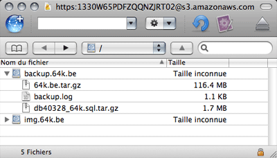

On utilise [Amazon S3](http://www.amazon.com/gp/browse.html?node=16427261) depuis 3 mois pour les fichiers statiques de 64k. Il s'agit d'un service d'hébergement très performant et bon marché utilisant l'infrastructure de serveurs d'Amazon. Mais S3 sert également à faire des backups, ce qui nous intéresse plus particulièrement dans ce billet.

J'avais déjà vu [cet article de Paul Stamatiou](http://paulstamatiou.com/2007/07/29/how-to-bulletproof-server-backups-with-amazon-s3) qui explique comment faire un backup de son site avec ce service, mais je n'avais pas vraiment pris le temps de tester. Je suis tombé sur [un billet de Christina Warren](http://www.christinawarren.com/2008/06/24/s3-backup-media-temple-gs) qui m'a décidé, puisqu'il décrit toute la procédure pour faire un backup d'un [(gs) Grid-Service](http://mediatemple.net/webhosting/gs/) de [Media Temple](http://www.mediatemple.net/) sur Amazon S3. Justement le même hébergement que 64k.
La procédure devrait également fonctionner si votre hébergement dispose d'un accès SSH et de Ruby On Rails, mais elle est principalement destinée aux (gs) Grid-Service. Mais bon comme [presque](http://www.gatellier.be/blog) [tout](http://vinch.be) le [monde](http://nkox.be/) en a un ^-^

Pour commencer, connectez-vous en SSH à votre serveur :
<pre>ssh serveradmin%monblog.com@monblog.com</pre>
Récupérez S3Sync avec wget :
<pre class="syntax-highlight:bash">wget http://s3.amazonaws.com/ServEdge_pub/s3sync/s3sync.tar.gz</pre>
Décompressez l'archive
<pre class="syntax-highlight:bash">tar xvzf s3sync.tar.gz</pre>
Excécutez cette série de commande :
<pre class="syntax-highlight:bash">rm s3sync.tar.gz
cd s3sync
mkdir certs
cd certs
wget http://mirbsd.mirsolutions.de/cvs.cgi/~checkout~/src/etc/ssl.certs.shar
sh ssl.certs.shar
cd ..
mkdir s3backup</pre>
Cela va supprimer l'archive, créer les différents dossiers et mettre en place les certificats SSL nécessaires à S3.

Maintenant il faut aller dans le dossier **/users/.home/s3sync** que vous venez de créer et éditer le fichier **s3config.yml.sample** avec vos **aws_access_key** et **aws_secret_access_key.**
<pre>aws_access_key_id: XXXXXXXXXXXXXXXXXXXX
aws_secret_access_key: XXXXXXXXXXXXXXXXXXXXXXXXXXXXXXXXXXXXXXXX
ssl_cert_dir: /home/XXXXX/users/.home/s3sync/certs
AWS_CALLING_FORMAT: SUBDOMAIN</pre>
**ssl_cert_dir** correspond au chemin vers votre dossier SSL, c'est-à-dire **/home/xxxxx/users/.home/s3sync/certs** où xxxx est le nom de votre serveur. Vous pouvez connaitre ce dernier en tapant pwd en mode console. Il faut également ajouter cette ligne : **AWS_CALLING_FORMAT: SUBDOMAIN**.
Sauvez ce fichier et renommer le en **s3config.yml**.

Editez le fichier **s3config.rb **et remplacer la ligne avec confpath = [xxxxx] par
<pre>confpath = ["./", "#{ENV['S3CONF']}", "#{ENV['HOME']}/.s3conf", "/etc/s3conf"]</pre>
Maintenant [téléchargez le script **backup_server.sh**](http://filmgirl.tv.s3.amazonaws.com/backup_server.sh) et modifiez-le avec vos paramètres (le dossier de votre blog à sauvegarder, le nom de votre serveur à la place de xxxxx, vos paramètres MySQL, le nom de votre bucket S3, etc).

Placer ce fichier dans le dossier **/data** et modifier ses permissions (755) :
<pre class="syntax-highlight:bash">chmod a+x backup_server.sh</pre>
Vous pouvez maintenant testez le script :
<pre class="syntax-highlight:bash">cd data
./backup_server.sh</pre>
Si tout fonctionne vous devriez trouver les backups sous forme d'archive gzip sur votre bucket Amazon S3.

[caption id="attachment_914" align="aligncenter" width="400" caption="Backup Amazon S3"][/caption]

<!-- excerpt -->

Pour peaufiner le tout, il ne reste plus qu'à configurer une tâche journalière qui va s'occuper de faire ça automatiquement. Il faut vous rendre dans l'interface de votre (gs) Grid-System et cliquer sur Cron Jobs. Le chemin de votre est script est :
<pre>/home/xxxxx/data/backup_server.sh</pre>
Et voilà, votre blog sera désormais sauvegardé chaque jour !
