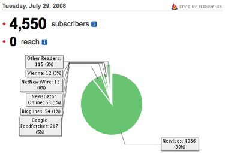

Je me demande bien à quoi correspond ce fichu compteur Feedburner. Vincent Abry vient de publier [son traditionnel top 100 des blogs en français](http://www.vincentabry.com/classement-feedburner-2008-des-blogs-en-francais-top100-1653). Et 64k.be apparaît à la … 28eme place. Devant des blogs comme <a title="CSS4Design" href="http://www.css4design.com/blog/" target="_blank">CSS4Design</a>, <a title="Wordpress Francophone" href="http://www.wordpress-fr.net/category/blog" target="_blank">Wordpress Francophone</a>, <a title="Gonzague Dambricourt" href="http://blog.gonzaguedambricourt.com/" target="_blank">Gonzague Dambricourt</a> ou <a title="NoFrag" href="http://www.nofrag.com/" target="_blank">NoFrag</a> et quasi au même niveau qu'<a title="Otto Chauffeur de Buzz" href="http://www.chauffeurdebuzz.com/" target="_blank">Otto Chauffeur de Buzz</a>. Alors qu'on tourne actuellement à moins de 600 visiteurs uniques par jour :p

<!-- excerpt -->

Il n'y aura pas comme un problème ?
