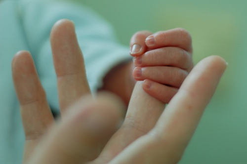
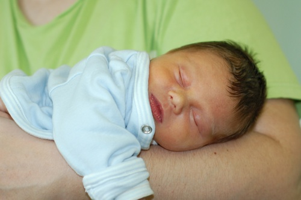

Je profite du repos bien mérité de mon petit bonhomme (il vient de s'enfiler 80 ml de lait, c'est pas rien!) pour écrire mon récit d'accouchement...

<!-- excerpt -->

Mercredi 6 août, 22h30 Ced va se coucher et je le préviens que je vais prendre une douche. Je sens de grosses gouttes me couler le long des cuisses. Fuite pipi ? Périnée qui lache? Les grosses gouttes sont transparentes et très  liquides mais ça ne m'étonnerait pas que ce soit de l'urine parce que j'ai bcp bu, donc mon urine n'est pas censée être jaune ni sentir. Je fais un amniodétect en laissant de grosses gouttes un peu partout dans la maison (le temps de la traverser pour aller chercher le test) et je prends ma douche le temps qu'il sèche. Il est resté bleu!
Je préviens Ced "Ne panique pas mais j'ai perdu les eaux" Au début il ne me croit pas, donc je lui explique qu'il faut terminer de préparer les valises (les affaires d'Elliott séchaient encore de la veille), moi je tente tant bien que mal de me rhabiller sans en foutre partout, je mets une grosse serviette et on improvise une alèse pour la voiture de Ced et go. 23h30 nous arrivons à la clinique. On vérifie que j'ai bien perdu du liquide amniotique et je passe un monito. Il est tout plat! J'avais + de contractions la semaine dernière! L'accoucheuse m'explique qu'elle va m'ausculter. Elle me fait un TV et mon col est ouvert à 3 cm. Elle nous conduit dans une salle d'accouchement en disant que si vers 3h, le travail n'est pas commencé, on provoquera les contractions. A ce moment là, il est +- minuit quart. On s'installe dans la salle d'accouchement, je me change, j'avais amené une liquette boutonnée sur l'avant pour pouvoir avoir mon bébé contre moi dès sa sortie. L'accoucheuse me fait une prise de sang. Pendant ce temps là, Ced va régler les détails de l'admission à la clinique. Assez impressionnant d'être couchée dans une salle d'accouchement! J'ai du mal à y croire. je fais le tour du propriétaire, il y a une baignoire, un ballon, des tabourets, le matériel pour les premiers soins des bébés... Une demi heure se passe à marcher dans cette pièce.

Puis une envie folle d'aller à selles. Je vais dans le couloir et demande où sont les toilettes à une autre accoucheuse qui arrive avec un autre couple et les installe dans la salle d'à côté. Heureusement, les toilettes sont la porte plus loin, j'ai eu un mal de chien à arriver jusque là! Je m'assieds difficilement et j'ai l'impression d'avoir l'anus éclaté. Ca m'étonne parce que j'avais la diarrhée depuis deux jours, alors pq cette constipation d'un coup? Fin bref. Ca va mieux, je retourne dans la salle d'accouchement.
Paf, deuxième envie subite, super douloureuse et là ça fait tilt, c'est une contraction! Je regarde l'heure, 00h50. Mon travail commence! Je panique un peu, il me faut quelques minutes pour me remettre en tête les conseils de ma kiné. Ca fait un mal de chien. Je tente de respirer calmement mais la douleur me coupe le souffle!  C'était quoi encore ces positions de travail? J'essaie de m'asseoir sur le ballon. Je me dis que c'est super efficace car je sens moins la contraction. Donc je ne bouge pas de là et j'attends la suivante en ondulant le bassin de gauche à droite. 30 secondes passent. Ca recommence. En fait le ballon ne me fait pas moins mal c'est juste que la contraction se terminait. Mais 30 secondes? C'était pas 5 minutes? Je cherche une autre position, pliée en deux, à 4 pattes contre le ballon, appuyée contre un mur... vivement que ced arrive pour m'aider. Puis ça se calme.
Puis presque tout de suite, de nouvelles douleurs, Ced arrive alors que je suis encore en train d'essayer des positions. J'ai mal c'est horrible, je ne panique plus mais je me rends compte que je n'ai pas d'autre moyen de faire. Je pense à la péri puis je m'interdis d'y repenser. La contraction passe. Je me raisonne, je me dis que de toutes façons, chaque contractions aussi douloureuse qu'elle soit, fini par passer. Rhaaaaa ça recommence, qu'on me foute cette saleté de périiiiiiiii. Quand l'accoucheuse revient, je lui dis "et si par hasard je demandais la péri?" et là elle m'explique qu'il faut d'abord attendre une heure le résultat du labo pour savoir comment la doser. Je suis sur le point de tomber dans les pommes; Une heure??? je serai morte dans une heure! Enfin je ne dis rien, à part "ah ok" et une contraction revient et je gémis pour l'accompagner. Ca ne change rien à la douleur mais au moins, je l'exprime, ça me fait du bien.
Le temps se passe et aux moments où je sais réfléchir, je me conditionne pour les contractions qui suivent. façon de se mettre, façon de respirer, façon de gémir. A chaque contraction j'ai l'impression que je vais mourir de douleur. Aucune position ne calme cette douleur et les gémissements deviennent des cris;
L'accoucheuse me dit qu'elle va m'ausculter et là elle m'apprend que je suis presque complètement dilatée. Elle prépare le matériel pour commencer l'expulsion, m'installe les pieds dans les étriers. Je demande si je peux m'asseoir parce que la douleur est encore plus fort quand je suis couchée. Elle accepte et incline le dossier du lit, et descend les étriers. Je ne suis pas très bien mise mais au moins c'est plus supportable que sur le dos. Elle appelle sa collègue et m'explique que dès la prochaine contraction, quand je sens que ça pousse sur mon anus, je devrai inspirer et bloquer ma respiration pour pousser, puis souffler lentement en continuant de pousser quand je ne sais plus bloquer. Comme quand on va à selles. J'ai l'impression que ses mots se promènent autour de moi en faisant des noeuds. Pousser quand je souffle. Souffler sans respirer? Hein? Une contraction se pointe et finalement, je fais comme je le sens. "Poussez madame" "oui beh ça va relax, je pousse là". En fait on ne me l'avait pas dit, mais il faut pousser fort. Pas juste laisser son périnée s'ouvrir et se dire qu'on "laisse descendre". Non, il est à la sortie et je dois pousser fort. Bon ok, la prochaine je pousse très fort.
La prochaine arrive. Les autres aussi. Les contractions arrivent en rafale. je me dis que c'était beaucoup de théorie, tout ce que j'ai lu, des contractions de 1minute, toutes les 2 à 5 minutes.... J'ai eu des contractions de 30 secondes, avec 15 secondes de répit entre chaque. Des contractions en rafale, vraiment. Donc je pousse et je hurle et entre les contractions, je me souviens avoir dit qu'il faudra m'excuser auprès de la dame de la salle d'à coté, si elle n'est pas encore partie en courant; Le gynéco arrive, déjà en blouse et s'installe entre mes jambes, et directement, me demande si je suis une grande sportive, ou si j fais de l'équitation, parce que j'ai un périnée balèze. Je ne fais rien de tout ça... Je ne l'entends déjà plus parler, Ced sent mes contractions dans sa main. La tete n'avance pas beaucoup et quand elle avance, elle recule juste après. Le gynéco me dit ça et m'explique qu'il va sans doute me falloir un peu d'aide, en coupant et en utilisant si nécessaire une ventouse. Là je suis sur le point de pleurer mais comme j'ai déjà du mal à respirer je n'arrive pas non plus à pleurer. Il me propose de mettre un miroir en face de mes jambes pour que je puisse voir ce qu'il se passe. Les contractions qui suivent me paraissent encore plus douloureuses parce que mes poussées sont plus efficaces, je vois dans le miroir la tête de mon bébé qui avance un peu à chaque fois que je pousse. Je vois mes peaux s'écarter, qu'est ce que c'est moche quand même; Entre deux contractions, je dis au gynéco "et vous voyez ça toute la journée vous...." il se marre. Il est vraiment très gentil. Il me parle, me demande le prénom. Entre les contractions, j'ai l'entre jambes tellement endolori que je ne sens plus rien. Nouvelles contractions, il me prévient qu'il va devoir me faire une épisio. Je lui demande d'enlever le miroir. Il m'anesthésie l'endroit et coupe et je ne sens plus ses doigts, ça fait bizarre. Par contre quand je le vois prendre ou poser ses instruments, je vois qu'il est plein de sang. J'ai beau supporter la vue du sang, ça m'a toujours impressionnée ce rouge vif. D'autres contractions, d'autres poussées et les accoucheuses me tiennent les jambes parce que j'ai tendance à les resserrer, elles appuient aussi sur mon ventre mais là je dois absolument rassurer celles qui pensent que quand on appuie sur le ventre, on subit son accouchement au lieu d'être active: ça n'a absolument rien fait à la progression d'Elliott, tout ce que ça a fait, c'est me faire mal mais c'est bien moi qui ai fait progresser Elliott jusque là. Je me suis sentie actrice, jusque là. Jusqu'à ce qu'il sorte sa ventouse, un gros appareil qui s'appelle vacuum, ça veut dire aspirateur en anglais je crois. Enfin le nom du truc m'a marqué;
Il a installé la ventouse et m'a dit qu'en quelques contractions, quelques poussées, Elliott serait dans mes bras. Effectivement, ça a pris 6 contractions. Avant ça je ne pensais pas pouvoir avoir encore plus mal. Mais la ventouse qui tirait d'un coté, une accoucheuse qui tenait les jambes, l'autre qui appuyait de toutes ses forces sur mon ventre, et je criais "stoooop arretez d'appuyer, arretez" et en même temps j'avais mal entre les jambes et sur le ventre et je hurlais. Je m'entendais hurler et je me demandais d'où je sortais ce son! Même Ced a eu l'impression qu'il y avait un monstre qui allait sortir de ma gorge! C'est vraiment étrange, c'est bestial. Puis pendant ces contractions, je me sentais comme si je pleurais mais sans pleurer tellement la douleur était puissante et je disais "je suis nulle, je suis vraiment conne, je suis nulle, je ne sais même pas accoucher" Là encore, heureusement que Ced était là pour me dire que je n'étais pas nulle!

Puis après il est né, j'ai senti ses épaules passer puis le reste glisser, puis tout de suite tout chaud contre ma poitrine et je n'avais plus mal nulle part, il venait de me libérer, c'est vraiment comme ça que je l'ai senti, le premier cadeau que mon bébé m'ait fait, c'est de me libérer de la douleur si puissante. Quel lien ça crée entre lui et moi, cette délivrance! Rien que pour ça, je le referais sans péri! Toutes les raisons que je trouvais pour prêcher le "sans péri" se sont effacée et c'est celle-ci, la délivrance grâce à Elliott, à laquelle je n'avais pas du tout pensé, qui est la meilleure raison d'entre toutes!

Il était déposé à même ma peau et j'ai oublié tout le reste, je ne sais plus. Un masque à oxygène quelques minutes en face de son nez, mais pas collé à lui, un essuie sur lui et mes mains, il était minuscule, encore en position fœtale, tout bleu et il est vite redevenu rose, il n'a pas pleuré, il a gazouillé tout de suite.
Voila, je suis tout de suite tombée amoureuse de lui.

Pendant l'accouchement, je dois une fière chandelle à son papa, parce qu'il m'a soutenue comme je ne m'y attendais pas. Je crois que j'aurais pleuré de le voir souffrir comme ça et lui il était fort, il me tenait la main, il était toujours là à m'encourager et à me soutenir...

Elliott est né le 7 août 2008, date magique, à 2h44, heure magique, avec 2kg820 et 48 cm.
