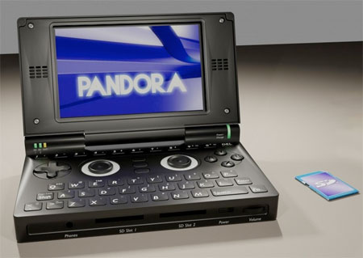

Encore à l'état de rumeur il y a un an, le projet de console [Pandora](http://www.officiel.quebecpandora.ca/) est désormais concret. En effet, les  3000 premières machines viennent d'être été pré-commandées en quelques jours.

<!-- excerpt -->

La Pandora a été développée sur base des idées des membres de la communauté "feu" [GP32X](http://fr.wikipedia.org/wiki/GP32), avec un but simple : créer la console open source ultime.  Elle a un format proche de la Nintendo DS, un clavier QWERTY, un écran tactile 800 x 480 pixels, un processeur cadencé à 600 Mhz, un accélérateur graphique OpenGL, WiFi, Bluetooth, une sortie TV, un port USB ainsi que deux slots SDHC. De quoi faire tourner sans problème Quake 3 ou toute une série d'émulateurs (Super NES, Amiga, Megadrive, Playstation 1, …). Mais aussi Firefox puisque la console f avec une distribution Linux. Ce que la rapproche des netbooks comme l'Eee PC. Tout ça pour moins de 250€.

Et pour terminer une petite vidéo nostalgeek ^-^

<object classid="clsid:d27cdb6e-ae6d-11cf-96b8-444553540000" width="425" height="344" codebase="http://download.macromedia.com/pub/shockwave/cabs/flash/swflash.cab#version=6,0,40,0"><param name="allowFullScreen" value="true" /><param name="src" value="http://www.youtube.com/v/KwuI6_zCjxY&amp;color1=0xb1b1b1&amp;color2=0xcfcfcf&amp;hl=en&amp;fs=1" /><embed type="application/x-shockwave-flash" width="425" height="344" src="http://www.youtube.com/v/KwuI6_zCjxY&amp;color1=0xb1b1b1&amp;color2=0xcfcfcf&amp;hl=en&amp;fs=1" allowfullscreen="true"></embed></object>
