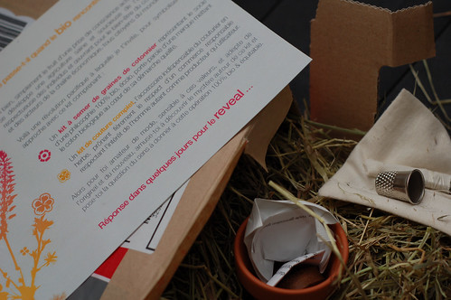
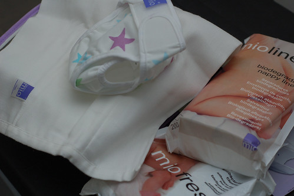

C'est le titre de ce buzz bio reçu par le courrier aujourd'hui.

"_C'est simplement le fruit d'une prise de conscience actuelle, dans lequel se développe une agriculture saine et soucieuse de l'environnement, respectueuse des individus et œuvrant pour le bien-être du consommateur et des acteurs de la chaîne économique, tous citoyens du monde_."

Aujourd'hui, je fus surprise de découvrir du foin dans un colis, on serait surpris pour moins que ça. Il y avait également un petit pot en terre cuite comprenant 10 graines de cotonnier et un petit cachet de terre compressée. J'y ai aussi trouvé un petit sac de coton renfermant des ciseaux et un dès de couture ainsi qu'un bouton et une attache de nourrice.

<!-- excerpt -->

Ce colis en accompagnait un plus grand qui contenait les couches lavables Bambino Mio que j'avais commandées la semaine dernière sur [biolange.fr](http://www.biolanges.fr/).

Ah voila! Je suis donc décidément cataloguée comme "bio".

Ok, ça me va.

On me propose de chercher le mystère qui entoure ce kit et de "_me poser la question du sens à donner à cette opération 100% bio et équitable_" Un indice? Ca a un rapport avec la mode (beh tiens...)

On me donne également rendez-vous dans quelques jours pour le _reveal_.

Si vous avez des idées....

Alors tant qu'on est dans le bio, je dois ab-so-lu-ment faire de la promo pour [l'excellent blog de deux couples de parents natures](http://www.parentsnature.be/). Ced m'a fait découvrir ce blog aujourd'hui, et l'a lui-même découvert par le biais de l'un de ses collègues (qui est l'un des parents). Moi ça me tente bien tout ça. Echarpe de portage, allaitement, couches lavables... J'ai testé l'écharpe de portage et c'est miraculeux. Malheureusement, l'allaitement n'a pas été possible et donc j'ai recours au lait artificiel, mais je me réjouis qu'Elliott soit allergique aux pampers pour avoir cette excellente excuse d'utiliser des couches lavables "parce que c'est meilleur pour la santé" et d'ajouter que ça me fait faire une économie de 1500 euros et que c'est mon geste écolo sur les deux années qui viennent. Moins de déchets :une tonne de jetables par enfant de la naissance à la propreté quand même! Alors non seulement les jetables mettent une éternité à se dégrader mais en plus, la substance absorbante reste active encore dans les décharges et absorbe l'humidité qui est nécessaire à la dégradation des autres déchets. Je ne ferai pas plus de machines car j'ai assez de couches pour les mettre dans la tournante habituelle. Bon j'arrête le plaidoyer, pour les récalcitrants, voici [une liste non exhaustive des avantages de la couche lavable](http://www.parentsnature.be/couches-lavables/10-bonnes-raisons-dutiliser-des-couches-lavables).

Pour continuer sur la vague "naturelle", j'aimerais beaucoup dès que c'est possible, avoir un potager pour donner à Elliott le gout des "vrais" légumes. Il me semble également important de contribuer au commerce des petits producteurs locaux. Les fraises de Vaudignies, miam :D C'est à deux maisons de chez nous et je ne me souviens pas avoir mangé d'aussi bonnes fraises auparavant.

Revenons-en aux couches lavables, j'ai commandé des Bambino Mio. Il y a plusiers types de couches lavables. Voici ce que j'ai compris.
<ul>
	<li>Il existe des "[tout en 1](http://www.biolanges.fr/couche-lavable/concept-couche-lavable-bumgenius-v3.asp)" (TE1 pour les intimes) qui sont en fait une culotte imperméable avec un intérieur tout doux et absorbant et une poche dans laquelle on vient insérer une serviette (un insert) encore plus absorbante (en chanvre ou en bambou). Il existe même des inserts doubles à utiliser pour la nuit lorsque le rejeton se décide enfin à dormir 8 heures d'affilée.</li>
</ul>
<ul>
	<li>Un autre système, [plus classique](http://www.lemondedelea.fr/couches-lavables-classiques-c-1_39.html) est de mettre une couche absorbante et une culotte imperméable par dessus.</li>
</ul>
<ul>
	<li>Enfin, un 3ème système, celui que j'ai choisi avec [Bambino Mio](http://www.biolanges.fr/couche-lavable/concept-couche-lavable-bambinomio.asp), est de plier un carré de coton et le mettre dans une culotte imperméable. C'est encore moins cher (100 euros pour 12 langes, 3 culottes, 200 feuillets de protection et un sachet d'antibactérien pour le trempage et/ou le lavage) et ça fait de moins grosses fesses que les autres solutions (en tout cas pour les "petits" bébés). Maintenant, Elliott approche les 5 kilos et la TE1 Bumgenius que j'ai reçu dans un kit (commandé déjà pendant la grossesse) ne parait plus du tout disproportionnée. J'attends qu'il ai dépassé les 7 kilos pour tester la couche classique reçue dans ce même kit.</li>
</ul>
Et donc bientôt un test complet des Bambino Mio...
