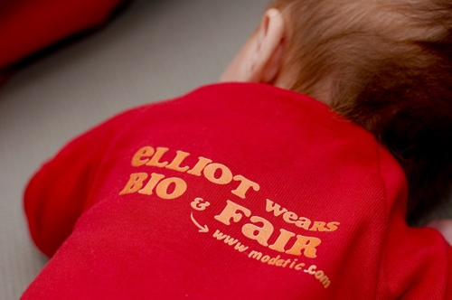
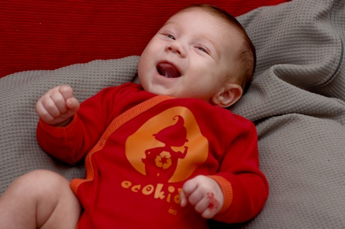

Voila donc ce que cachait le biobuzz de la semaine dernière: [Modetic](http://www.modetic.com/catalog/index.php), site engagé de vente de vêtements en coton biologique issus du commerce équitable.

Après les graines de cotonnier (qui germent déjà!) et le kit de couture, nous avons reçu un cadeau pour Elliott! Un super joli body manches longues de la marque [Ideo](http://www.ideocollection.com/). Voila ce qui arrive quand on devient une maman. Il y a quelques mois, j'aurais reçu une blouse pour moi. Là non, un body taille 3 mois qui va à merveille à Elliott ^^ Grand merci à eux! Petit geste encore plus sympa, le body est personnalisé au nom d'Elliott!

<!-- excerpt -->

[La philosophie de Modetic](http://www.modetic.com/catalog/page.php?p=notre_philosophie) est de permettre au consommateur de soutenir des actions sociales et écologiques tout en achetant des vêtements dont le design,  										la matière première et la finition sont de grande qualité. Il ne faut désormais plus choisir entre de beaux vêtements et des vêtements écologiques (parce que le tshirt beige difforme avec un logo misérable, j'ai testé pour la forme et parce qu'il se disait "bio-équitable" mais je ne l'ai mis qu'une seule fois).

Personnellement, le commerce équitable est important pour moi. Faute de choix, je me rabattais sur le chocolat (dont j'ai oublié la marque, je me ferai un plaisir d'en racheter pour m'en souvenir) mais après avoir survolé la boutique de Modetic, je pense me laisser tenter par quelques habits...

Bon voila, je suis officiellement militante...
