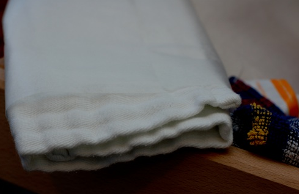
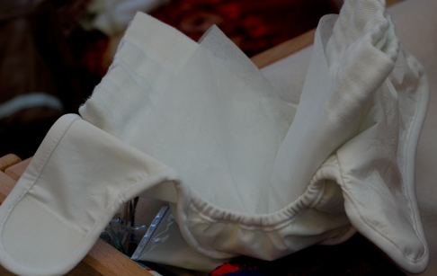

En-chan-tée! Je suis vraiment très contente des couches lavables que j'ai testées!

Donc pour reprendre le principe des couches lavables Bambino Mio: Il s'agit d'un rectangle de coton (plusieurs épaisseurs de coton) qu'on plie en 3, qu'on garnit d'une feuille de protection, puis qu'on plie en deux et qu'on installe dans une culotte imperméable. La feuille de protection recueille les selles et hop dans le pot ou dans la poubelle. Elle est biodégradable et on garde les doigts propres.

<!-- excerpt -->

Après des débuts un peu difficiles -4 changes complets et autant de fuites en 3 heures- je me suis rendue compte que j'essayais de mettre les fesses d'Elliott et toutes les épaisseurs de coton dans une culotte pour nouveau-né. Elliott a deux mois et demi et 5 bons kilos, cherchez l'erreur. Donc du coup il y a eu des fuites, forcément. Je me suis rapidement procurée des culottes de protection un peu plus grandes (j'en ai découvert dans un magasin près de chez moi!) et là c'est magique. Pas de fuite avec une couche hyper remplie qui aurait fait percer une jetable bien connue. Les fesses gardées sèches, l'irritation d'Elliott moins à vif qu'avec ce satané pseudo aloé-vera des jetables bien connues (ni pub, ni anti-pub, suis gentille!). Je me disais qu'éventuellement j'utiliserais des jetables la nuit, question de facilité, rapidité... Et bien même pas!!! Les langes sont pliés à l'avance, prêts à être installés dans la culotte et hop hop hop, ça ne prend pas une minute de plus!

Petites astuces: je mets le papier de protection à plat sur la couche au lieu de le plier autour du lange, puis je referme la culotte et je bourre dedans le papier qui dépasse. Comme ça en cas de diarrhée, les élastiques de la culotte sont protégés.

Autre astuce: il faut bien monter le plus haut possible l'élastique dans le dos, c'est plus facile ensuite pour ajuster les velcros sans trop serrer les cuisses.

**_Soyons pratiques: **_

_Les langes_ existent en 2 tailles et il en faudra 24 de chaque (avant et après 7 kg). 120 euros pour 24 langes en coton. X 2 jusque 17 kg : **240 euros en langes en coton**

_Les culottes_ existent en 5 tailles et il en faudra 4 (quoique là ça fait une semaine que je tourne avec 2 et ça va sauf si les élastiques sont à nettoyer avec une diarrhée liquide ou les selles plus liquides des bébés allaités). Nouveau-né (jusque 5kg), petit (jusque 7 kg), moyen (7 à 9 kg), large (9 à 12 kg) et très large (12 à 15 kg): 15 euros la culotte. 15 X 4 X 5= **300 euros en culottes imperméables**

_Le papier de protection_: 10 euros pour un rouleau qui tient 3 mois ( à 6 changes par jour +-), donc en 2 ans et demi, il faudra 10 rouleaux: **100 euros de papiers de protection**

_Le sachet d'antibactérien_ (facultatif): une cuiller à soupe ds l'eau de trempage ou dans le tiroir de la machine à laver. Disons qu'on tiendra une petite année avec un sachet de 750 gr. 14 euros le sachet. 3 X 14: **42 euros en antibactérien**

_Le seau à couches_: le mien a couté **10 euros** et ce n'était pas le moins cher.

24 couches permettent d'avoir une tournante suffisamment longue et de ne pas faire + de machines que d'habitude. J'en compte une tous les 3 jours

**Au total: 692 euros en couches lavables + accessoires **qui ne seront plus à dépenser pour les bébés qui suivront (s'il y en a)

Cette somme n'est évidemment pas dépensée en une seule fois: A la naissance, on a besoin de 24 langes, 4 culottes, on commence un rouleau de feuilles de protection, on commence aussi un sachet d'antibactérien, et on a également besoin d'un seau: 120 + 60 + 10 + 14 + 10 = **214 euros au début**.

Le reste vient petit à petit :4 nouvelles culottes en fonction de l'évolution du poids jusque 12 kg, 24 nouveaux langes quand on dépasse les 7 kilos, et les accessoires au fur et à mesure de la consommation...

Bon maintenant, je dois rester modérée. Elliott est encore petit, il ne gigote pas beaucoup comparé à dans quelques mois quand il rampera ou marchera à 4 pattes ou se déplacera sur ses fesses, ni comparé à dans un an quand il commencera peut-être à marcher... donc on verra à ce moment là si les culottes tiennent toujours aussi bien... en attendant je suis très satisfaite!

A raison de 6 changes par jour jusque 1 an et 5 changes par jour de 1 an à 2 ans et demi (de la théorie tout ça mais il faut bien se baser sur quelque chose). 365 X 6 = 2190 couches jetables pour la première année (sans compter les diarrhées). 547 X 5 = 2735 couches jetables de 1 an à 2 ans et demi (les cacas ne connaissent pas de week-ends!). Total: 4925 couches jetables. On va prendre l'exemple des jetables bien connues avec de l'aloé-vera, ce sont les couches les plus vendues parmi le panel des jetables: 12,60 euros pour 50 couches: **1241,1 euros en couches jetables**. (sans compter le nombre de sacs poubelle... une tonne de déchets en couches par enfant)

**Différence: 549,1 euros.... **

Si on compte qu'un ménage habituel a deux enfants: Pour le premier, on dépense 692 euros au lieu de 1240. Pour le second, on ne dépense que le prix des feuilles de protection et de l'antibactérien (en tout 142 euros) au lieu de redépenser 1240 euros. Donc **sur deux enfants, l'économie est de 1647 euros.... **etc. etc. à chaque nouvel enfant, pour autant que les culottes ne soient pas usées, mais elles semblent d'excellente qualité.

Service d'excellente qualité aussi sur le site [biolanges.fr](http://www.biolanges.fr/). Pour une commande passée le vendredi, j'ai reçu les paquets le mercredi.

Les couches sont aussi en vente chez [dreamland](http://www.dreamland.be/dreamland/static/fr.shtml), légèrement moins chères que sur le site (encore faut-il avoir un dreamland près de chez soi)

** **
