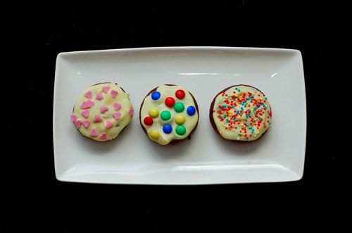

... ne sont plus ma bête noire en cuisine.

J'ai trouvé la recette qui les rend inratables, croquants sur l'extérieur, moelleux comme un brownie à l'intérieur...

**Ingrédients pour une vingtaine de petits muffins** (5 cm de diamètre quand ils sont cuits.. donc petits)
<ul>
	<li>des cups en papier (des petits, évidemment)</li>
	<li>3 oeufs</li>
	<li>60 gr de sucre fin</li>
	<li>60 gr de farine</li>
	<li>100 gr de beurre</li>
	<li>200 gr de chocolat fondant</li>
</ul>
**Pour le glaçage**:
<ul>
	<li>une tablette de chocolat blanc et puis c'est tout</li>
</ul>
**Pour la déco:**
<ul>
	<li>des petits brols colorés en sucre ou en chocolat (miam)</li>
</ul>
La recette dans la suite....

<!-- excerpt -->

**Recette des muffins au chocolat qu'ils-sont-trop-bons-et-que-je-me-retiens-de-tout-manger-avant-le-retour-de-Ced:**

Sortir la grille du four et préchauffer à 180°

Faire fondre très doucement (ou au bain-marie pour ceux qui aiment chipoter) le beurre et le chocolat coupés en morceaux.

Pendant ce temps là, mélanger les oeufs, la farine et le sucre.

Quand le chocolat est fondu et que la texture est bien lisse et appétissante, l'incorporer dans le mélange aux oeufs.

Remplir à la douille ou à la petite cuiller les 3/4 de chaque cup en papier. Attention important: les cups sont déjà installés vides sur la grille du four (pas facile à manipuler quand c'est rempli d'un truc chaud)

Autre chose: les petit cups en papier ont tendance à se déformer quand on les rempli de chocolat. Sophie-les-bons-tuyaux a trouvé pour vous LA solution (bon, pas compliqué, vous me direz) : on met 3 cups l'un dans l'autre, ce sera plus rigide (tadaaaaam)

On prend bien sûr le soin d'en rater un ou deux (ou trois), qui ne seront absolument pas présentables à la sortie du four, pour avoir l'excuse de les avoir mangé tout de suite.

10-15 minutes au four, jusqu'à ce que la croute soit craquelée, voire déchirée, si on veut une texture de fondant, 20 minutes si on veut une texture de cake. On a largement le temps de ramasser le fond du plat à la petite cuiller, juste pour vérifier que la pâte au chocolat était bonne.

Laisser refroidir une petite demi-heure (oui, c'est long)

**Le glaçage le plus facile du monde**: faire fondre du chocolat-blanc-et-puis-c'est-tout dans un petit poêlon en remuant avec une petite cuiller;

Déposer une cuiller à café (ou deux!) de chocolat blanc fondu sur chaque muffin et l'étaler (avec le dos de la cuiller)

Décorer alors que le chocolat n'est pas encore durci. Ca ne refroidit pas vite du tout, on a le temps de recouvrir tous les muffins avant de passer à la déco.

Hop au frigo!

**EDIT du lendemain**: Une tuerie ces petits gateaux!!! Encore meilleurs après une nuit au frigo!
