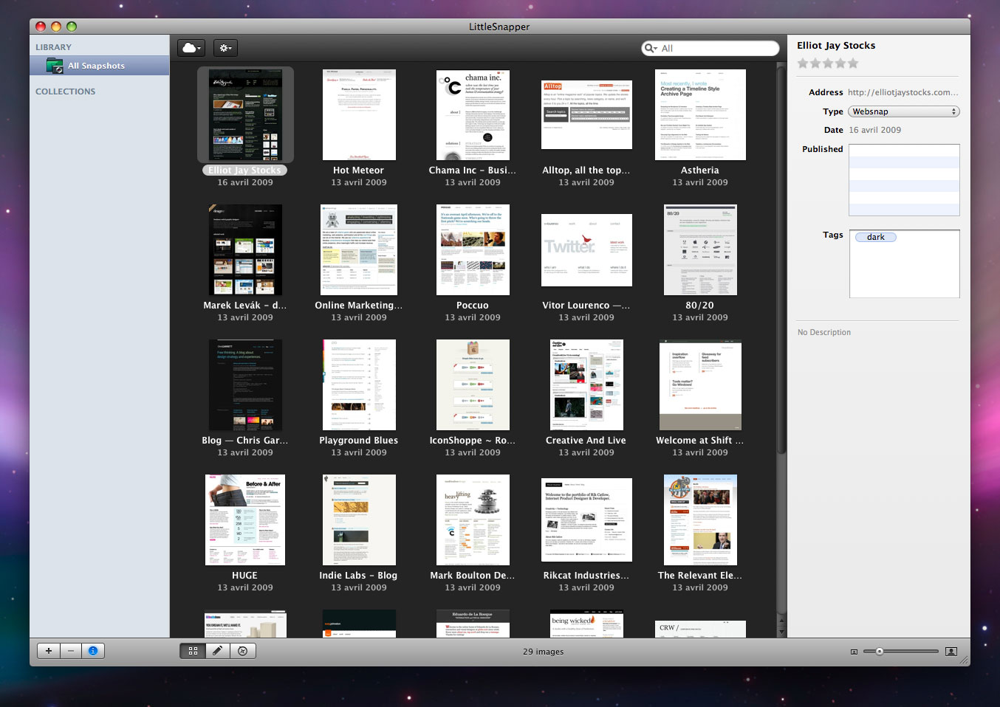
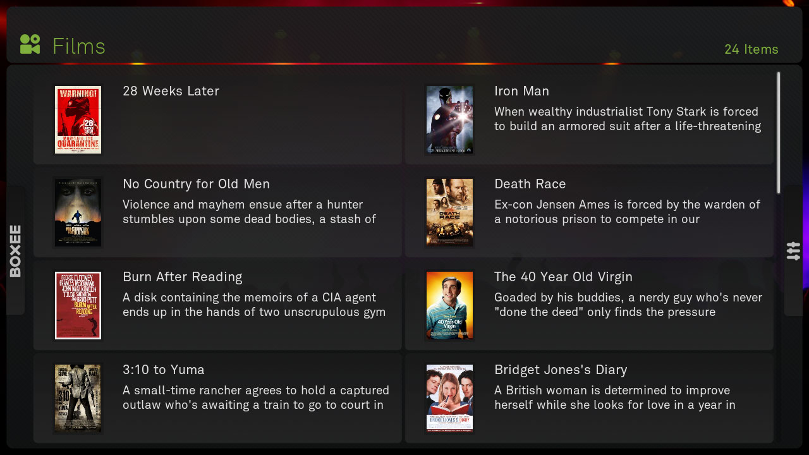
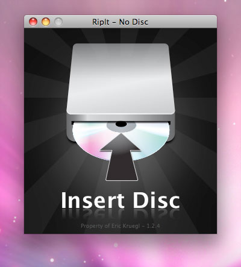
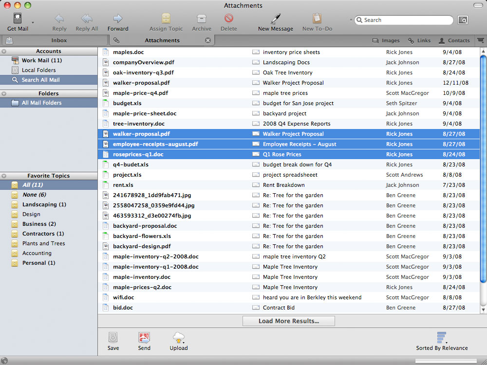
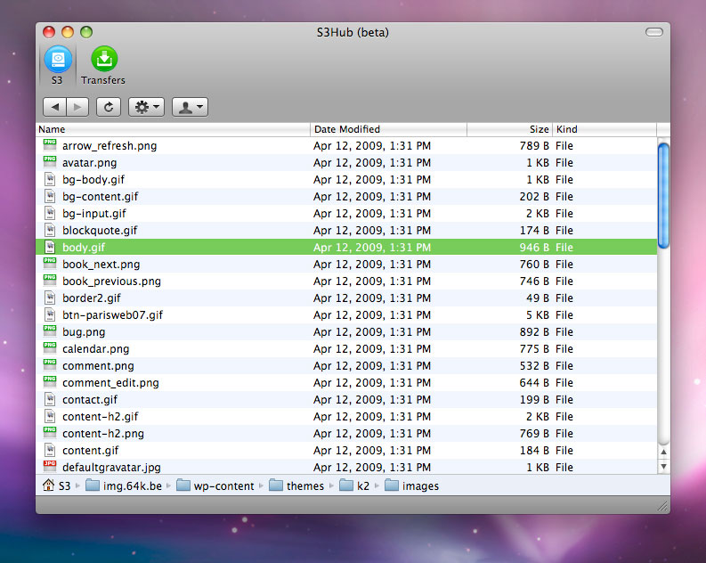

**Little Snapper**

<!-- excerpt -->

Quand on travaille dans le webdesign, on passe beaucoup de temps à surfer en quête d'inspiration sur des sites comme [CSS Remix](http://cssremix.com/) ou [Web Creme](http://www.webcreme.com/). L'idéal est de se faire une petite base de données avec les captures d'écran des designs sympas qu'on a trouvé. Mais c'est assez fastidieux à faire et à garder à jour. C'est là que [LittleSnapper](http://www.realmacsoftware.com/littlesnapper/) entre en action. En un clic, on a une capture d'écran du site ainsi qu'une archive web. Le tout est facilement classable grâce aux tags. LittleSnapper est lié au service [QuickSnapper](http://www.quicksnapper.com/) qui permet de partager ses trouvailles. Pour la petite histoire, il est édité par la même société que RapidWeaver. License commerciale (39$).

**Boxee**

[Boxee](http://www.boxee.tv/) est un [media center](http://fr.wikipedia.org/wiki/Centre_multim%C3%A9dia) très complet. Comme Front Row, il gère les images, la musique, les vidéos et la compatibilité avec l'Apple Remote est de la partie. En plus des fichiers locaux, il permet d'accéder à des contenus en ligne comme Youtube ou Last.fm. Le côté social est présent, avec des recommandations de vos amis. Il y a même une fonctionnalité pour trouver automatiquement des sous-titres via [OpenSubtitles](http://www.opensubtitles.org). Et puis le look est très chouette. License GPL.

**RipIt**

**
**

Ok, maintenant que vous avez intallé Boxee, plus trop le courage d'aller chercher vos DVD dans l'étagère ? [RipIt](http://ripitapp.com/) va vous permettre de ripper vos DVD sur votre disque dur. License commerciale (18,99$)

**Postbox**

Peut-on encore innover avec un client email ? C'est la question qu'on dû se poser les créateurs de [Postbox](http://www.postbox-inc.com/). L'innovation principale est la recherche. Par exemple vous cherchez le lien qu'un client vous a envoyé il y un moment ? Pas de problème, Postbox vous liste toutes les url présentent dans vos emails. Même chose avec les images et les pièces jointes. Il est basé sur le code de Thunderbird. License commerciale (version beta).

**S3Hub**

J'ai longtemps cherché un client [Amazon S3](http://aws.amazon.com/s3/) qui tienne la route. [S3Hub](http://s3hub.com/) est de loin de le meilleur. Bien intégré à l'interface de Mac OS, il est à la fois simple d'utilisation tout en prososant des fonctions avancées comme la modification des entêtes HTTP. Très pratique pour [optimiser son site](http://developer.yahoo.com/performance/rules.html#expires). License freeware.
