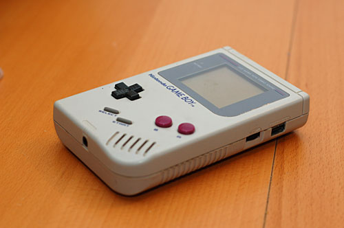

C'est en effet le 21 avril 1989 que Nintendo a lancé le [Game Boy](http://fr.wikipedia.org/wiki/Nintendo_Game_Boy) au Japon. Vendu à 118 millions d'exemplaires, il doit principalement son succès à un seul jeu : [Tetris](http://en.wikipedia.org/wiki/Tetris_(Game_Boy)). Mais également à son petit prix et sa grande autonomie par rapport aux consoles concurrentes. Ah que de souvenirs avec Super Mario Land 1 et 2 !

Je viens de retrouver le mien dans une caisse au grenier, j'ai mis 4 piles AA mais… aucune réaction. Pourtant il n'a pas fait [la guerre du Golfe](http://insolite.blog.playersrepublic.fr/images/medium_gameboy_gulfwar.2.jpg) :p

<!-- excerpt -->

