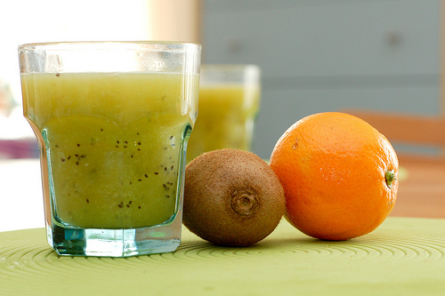

On a envie de soleil, de jus de fruits, de hamac, du bruit de l'océan et de la fine brise entre les palme du cocotier...On se voit cuire des crevettes tigrées dans des feuilles de bananier, à même la plage de sable blanc, au dessus d'un petit feu de bois. Puis on se réveille. On n'a pas gagné au loto. Pas encore.

A défaut du reste, on a déjà le jus de fruits.

Ma grande manie du moment c'est le smoothie. Alors aujourd'hui on va faire dans le simple et dans le vitaminé...

<!-- excerpt -->

**Des idées de smoothies pour deux personnes:**
<ul>
	<li>2 pamplemousses + 2 oranges + 2 kiwis ( ou 6 oranges si on n'aime pas les pamplemousses)</li>
	<li>6 oranges + 2 kiwis + 50 gr de framboises</li>
	<li>6 oranges+ 1 banane + 6 belles fraises</li>
	<li>4 oranges + 3 citrons verts + 1 mangue bien mûre</li>
	<li>1 mangue bien mûre + 1 verre de lait de coco+ 2 citrons verts (miam)</li>
</ul>
Alors pas besoin de centrifugeuse pour ceux-ci. On presse les agrumes, on met les autres fruits dans le mixer avec un petit peu du jus qu'on vient de presser (ça se mixe mieux quand il y a du liquide dans le bol du mixer... j'ai mon brevet de babycook), et hop.

Éventuellement un peu de glace pilée ou de lait selon les goûts.

Bon, ça se fait avec des légumes aussi. Jus de céleri, velouté froid de brocoli... bof hein (enfin chacun ses gouts)... mais ça doit être bourré de vitamines, alors...

D'autres recettes sur [epicurien.be](http://www.epicurien.be/recettes/boissons/jus/smoothies/recettes-smoothies.asp)
