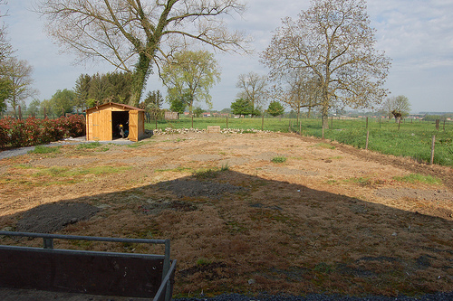
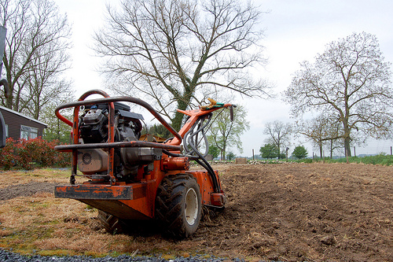
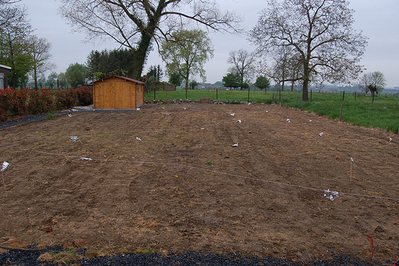
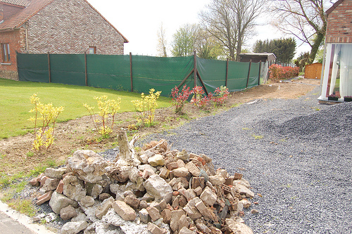
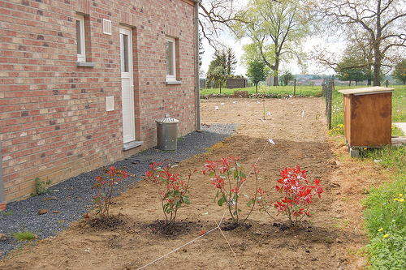
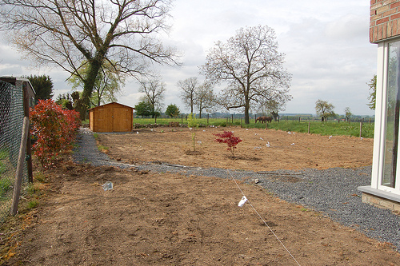
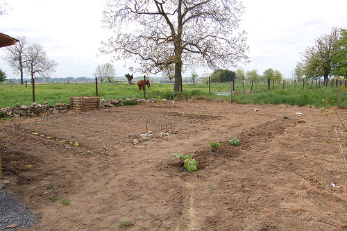

Hier c'était les grands travaux dans notre jardin. Nous avons enfin semé la pelouse. Je me réjouis des premiers pas d'Elliott dans le gazon :D

Avant...

<!-- excerpt -->

Pendant

Après

On a eu fini hier vers 21h.... un petit 12h de boulot quand même, pour motoculter, ratisser, re-motoculter, re-ratisser, damer, semer, re-damer, re-semer un peu, re-re-damer et protéger des oiseaux (qui s'en foutent mais ils préfèrent les vers de terre que les graines apparemment)

Et ce matin, on a replanté les arbustes à leur place définitive (4 photinias, un petit saule tortueux, un petit érable du Japon, un groseiller, un framboisier et un saule-boule). On a aussi continué notre potager. Ce sera tout petit, 6 m sur 5 m mais on aura quand même différentes sortes de salades (laitue, mesclun, roquette), des carottes, des radis, des oignons, des pommes de terre, des petits pois, des poireaux, des potirons et des fraises.

Et puis ce sera fleuri aussi :D Vivement l'été.

Une petit visite guidée...

A gauche et à droite de l'avant de la maison

Une vue sur le jardin à l'arrière

Le potager. Il faut imaginer des bordures en bois le long du potager et des sentiers en graviers. Il y a un parterre allongé pour les aromatiques, les fleurs et un plan de rhubarbe, et il y aura un autre parterre allongé dans l'autre sens où on va faire petit à petit une haie d'arbustes fruitiers (il y a déjà un groseiller et un framboisier).

