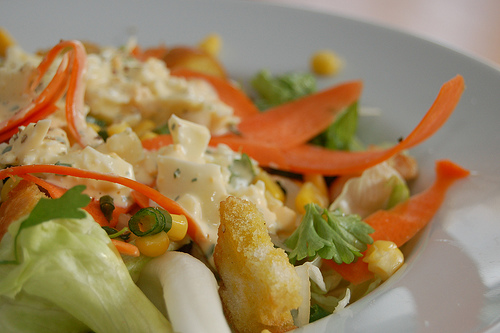

Presque. Oui parce que la vraie sauce César, il y a de la sauce werceshe... worcetir....worcestershire dedans. Un mélange à base d'anchois et de mélasse et d'autres trucs moins mauvais. Donc bon. J'ai mis la sauce... à ma sauce.

Du coup c'est un peu moins diététique qu'hier. Mais juste un peu. Je ne veux pas être tenue responsable du bourrelet en trop dans le bikini!

<!-- excerpt -->

J'hésite tiens.... Je mets l'historique de la sauce César ou pas? Bon en très très résumé, c'est une sauce qu'on fait avec ce qu'il reste. Le pain rassis, les restes de poulet, le reste du fromage qui durcit dans le fond du frigo (mais de bons restes, du parmesan ça en jette mieux que du gouda), les deux œufs pas suffisants pour faire une bonne omelette.

La sauce Worcemachin, je ne vois pas bien comment on peut en avoir dans le fond de son armoire. Mystère.

En moins résumé, sur Bon appétit [Wikipédia](http://fr.wikipedia.org/wiki/Salade_C%C3%A9sar) [bien sûr](http://www.youtube.com/watch?v=5UGXirbpYX8&amp;feature=player_embedded).

Alors pour fêter le mercredi, **la salade (presque) César**. Comprenez sans sauce Worcestershiiiiire.

Pour 2 personnes. Préparation: 30 minutes.
<ul>
	<li>De la **salade** iceberg bien croquante.</li>
</ul>
**Pour la garniture:**
<ul>
	<li>Un blanc de poulet</li>
	<li>Une petite boite de maïs</li>
	<li>Un petit oignon de la saison</li>
	<li>Du persil plat</li>
	<li>Une tige d'oignon. Explications plus bas :-)</li>
	<li>Une carotte</li>
	<li>Un peu de menthe du jardin (pas obligé mais je me la pète depuis que j'ai de la menthe dans le jardin)</li>
	<li>10-15 cm de baguette</li>
	<li>De l'huile d'olive</li>
	<li>Du sel et du poivre</li>
</ul>
**Pour la sauce:**
<ul>
	<li>2 cuillers à soupe de mayonnaise  (c'est là que c'est moins diététique)</li>
	<li>Un filet d'huile de d'olive (oui là aussi)</li>
	<li>Un petit peu d'eau</li>
	<li>Un peu de jus de citron</li>
	<li>Du persil ET du persil plat</li>
	<li>2 oeufs cuits durs</li>
	<li>Du sel et du poivre</li>
</ul>
Alors alors.

On commence par cuire **le poulet** coupé en petits dés. On cuit doucement au début, puis un peu plus fort jusqu'à avoir une belle couleur dorée. Puis on met de côté.

Pendant que le poulet cuit, on prépare** les croutons** en découpant des bouts de baguette et en les trempant en vitesse dans un peu d'huile d'olive assaisonnée. On les met dans un plat qui va au four (j'utilise un moule rectangulaire, le même que pour les brownies), et hop 120 degrès, air pulsé, pendant..... aucune idée.... 5-10 minutes? On les touche une fois de temps en temps avec une fourchette pour vérifier et si c'est un peu durcit c'est que c'est bon. Puis on les retourne (sinon l'autre côté, un peu moins cuit, ramollit), et on met de côté. On _réserve_ comme dirait l'autre.

Pour **le reste de la garniture**: Dans une passoire, on met le maïs, le persil plat, l'oignon coupé en très fines lamelles (mais un petit oignon de printemps hein! Ou alors un demi gros), la menthe (du jardin!!!) coupée en lamelles aussi, la carotte coupée en trèèèès fines tranches sur le sens de la longueur (avec le [rasoir à légumes](http://www.couteaux-services.com/content/product_893276b.jpg), pas au couteau!). On coupe la tige d'oignon en petits morceaux. Donc la tige d'oignon c'est en fait... ce qui sort de la terre quand on a planté des oignons. Ca ressemble à de la grosse ciboulette d'1 cm de large. C'est le vert d'oignon en fait. Y a un autre nom pour ça? Et on nettoie à grandes eaux puis on laisse un peu égoutter.

On prend ensuite les belles feuilles croquantes de la **salade** et on les coupe un peu comme on veut. Puis on les met dans une assiette et on met un filet de jus de citron dessus. Ou du vinaigre mais bof. Jus de citron c'est mieux.

On dresse la garniture par dessus.

Pour **la sauce**, on mélange l'huile d'olive, la mayonnaise et le jus de citron et on y ajoute les oeufs cuits durs écrasés grossièrement (10 minutes dans l'eau bouillante à partir de la reprise de l'ébullition), les persils et on assaisonne. Puis on ajoute un peu d'eau, selon les goûts, pour décider de l'épaisseur de la sauce.

Quelques cuillers de sauce au dessus de tout ce petit monde bien coloré...

Et voilaaaa... (tadaaaaaam)
